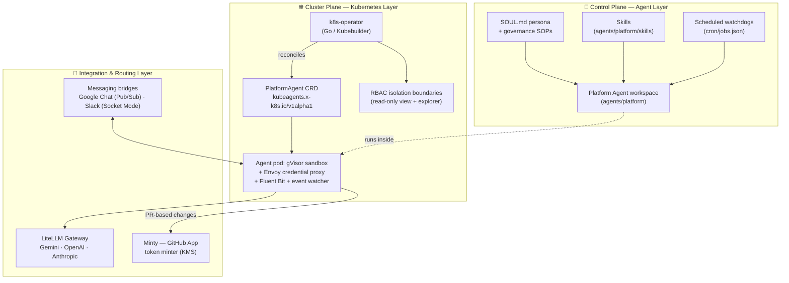

# 🧭 kube-agents — The Kubernetes Agentic Harness

**Stop driving your clusters. Start delegating them.**

## Introduction

`kube-agents` replaces the traditional imperative DevOps presentation layer — `kubectl`, `gcloud`, the Google Cloud Console — with autonomous, proactive AI agents that manage your Kubernetes/GKE infrastructure, enforce multi-tenant governance, and continuously audit security posture. Instead of you reacting to pages and typing commands, a **Platform Agent** watches your fleet around the clock, opens pull requests with fixes, and reports to you in chat.

| Traditional Ops                              | With `kube-agents`                                                                                           |
| -------------------------------------------- | ------------------------------------------------------------------------------------------------------------ |
| Reactive, manual toil (`kubectl` + runbooks) | Proactive, intent-driven operations                                                                          |
| Drift discovered during incidents            | Scheduled compliance & blueprint audits ([10 autonomous watchdogs](agents/platform/cron/jobs.json))          |
| Hand-rolled RBAC and tenancy reviews         | Automated RBAC & boundary enforcement, [credential isolation by design](docs/credential-isolation-design.md) |
| Patch Tuesdays and CVE spreadsheets          | Daily vulnerability & patch scans with staggered rollout orchestration                                       |
| One human, one terminal                      | ChatOps with the agent over Google Chat & Slack                                                              |

## Table of Contents

- [Introduction](#introduction)
- [⚡ Try it now](#-try-it-now)
- [📖 Overview](#-overview)
- [🚀 Installation & Quickstart](#-installation--quickstart)
- [🛡️ Governance & Multi-Tenancy](#️-governance--multi-tenancy)
- [🏗️ End State Architecture](#️-end-state-architecture)
- [🤝 Contributing](#-contributing)
- [Disclaimer](#disclaimer)

---

## ⚡ Try it now

The fastest way in: clone this repository into your agent harness's workspace and delegate the setup itself to an agent:

```text
"Using kube-agents/INSTALL.md provision k8s agentic harness and create platform agent"
```

[INSTALL.md](INSTALL.md) is written so that an AI agent with file access and shell tools can follow it end-to-end — and the same guide works step-by-step for humans.

**Installing by hand?** The Platform Agent is a self-contained workspace directory. Copy it into a harness running the Hermes agent runtime and register it:

```bash
cp -r agents/platform /path/to/harness/workspace/agents/platform
```

Then point your harness at the workspace — system prompt from `SOUL.md`, MCP servers and toolsets from `config.yaml`, skills auto-discovered under `skills/`, scheduled jobs from `cron/jobs.json` — following the [manual install guide](https://gke-labs.github.io/kube-agents/install/manual/).

Full setup options — from a one-command GKE provisioning pipeline to local Kind development — are in [INSTALL.md](INSTALL.md) and covered in [Installation & Quickstart](#-installation--quickstart) below.

---

## 📖 Overview

At the heart of the harness is the **Platform Agent (`platform`)** — the master custodian and agent architect. It serves as the primary chat entrypoint into the entire harness, manages the GKE infrastructure lifecycle, establishes multi-tenancy boundaries, and enforces fleet-wide compliance.

The Platform Agent is driven by:

- 🧬 **An architectural persona** — [`agents/platform/SOUL.md`](agents/platform/SOUL.md) defines its identity, its _Automation First_ rule (no manual cluster mutations; all changes flow through declarative, PR-based workflows), and its _Least Privilege_ constraint (read-only fleet visibility; every infrastructure change is proposed as a pull request, never applied directly).
- 📚 **Operational playbooks** — nine governance SOPs in [`agents/platform/governance/`](agents/platform/governance/) covering blueprint sync, compliance audits, cost analysis, capacity orchestration, security patch orchestration, lifecycle/deprecation management, and more.
- 🛠️ **Specialized Skills** — 20 task-focused skills under [`agents/platform/skills/`](agents/platform/skills/), each a documented `SKILL.md` bundle: cluster creation from templates, app onboarding, workload troubleshooting, cost analysis via BigQuery, observability setup, autoscaling, backup & DR, and manifest generation, among others.

The agent runtime is built on the Hermes agent framework and wires in MCP servers for platform control and GKE's hosted MCP endpoint, so the agent speaks to your clusters through structured tools rather than raw shell access.

📗 **Full documentation** lives at [gke-labs.github.io/kube-agents](https://gke-labs.github.io/kube-agents/), including the [architecture](https://gke-labs.github.io/kube-agents/overview/architecture/), [concepts](https://gke-labs.github.io/kube-agents/concepts/), and a [complete skill catalog](https://gke-labs.github.io/kube-agents/skills/).

---

## 🚀 Installation & Quickstart

The recommended path is the automated provisioning pipeline — modular and idempotent, taking you from an empty GCP project to a production-grade deployment:

```bash
cd k8s-operator
make gcp-provision
```

The pipeline runs 11 staged scripts (each re-runnable and supporting `--dry-run`): GKE cluster creation, a gVisor-sandboxed node pool, operator + CRD installation, IAM & Workload Identity, Google Chat Pub/Sub wiring, Slack integration, secrets, the Platform Agent Custom Resource, the LiteLLM gateway, the GitHub token minter, and inference replay. A matching `make gcp-teardown` reverses everything.

Deploying onto an existing cluster, or iterating locally against [Kind](https://kind.sigs.k8s.io/)? [INSTALL.md](INSTALL.md) covers the manual deployment and local development paths step by step.

---

## 🛡️ Governance & Multi-Tenancy

`kube-agents` is designed for enterprise fleets where agents must be powerful _and_ provably contained.

### Isolation by construction

- **Least-privilege RBAC boundaries** — the operator provisions each agent with read-only (`view` + a scoped custom `explorer` ClusterRole) fleet visibility; the only write grant is a single Role scoped to the agent's own namespace, covering leader-election leases and `get`/`patch` on pods. Infrastructure changes happen exclusively through the GitOps path below.
- **Credential isolation** — the agent sandbox container _never_ receives API keys or tokens. An Envoy credential-proxy sidecar injects credentials at the network boundary, and the sandbox image ships only non-functional CLI wrappers — the real credential-aware CLIs live in a separate, inaccessible image. See the full design in [docs/credential-isolation-design.md](docs/credential-isolation-design.md).
- **Kernel-level sandboxing** — agent workloads run under a gVisor RuntimeClass (GKE Sandbox), validated by the operator at reconcile time.
- **GitOps-only mutations** — the agent proposes changes as pull requests (via the `submit-suggestion` skill and short-lived GitHub App tokens minted through KMS) for human SRE review; it does not apply mutations directly.

### Scheduled governance watchdogs

Ten cron-driven jobs in [`agents/platform/cron/jobs.json`](agents/platform/cron/jobs.json) keep the fleet honest without human prompting:

| Watchdog                        | Cadence      | What it does                                             |
| ------------------------------- | ------------ | -------------------------------------------------------- |
| Blueprint Sync                  | Daily        | Checks cluster state against master blueprints           |
| Compliance Audit                | Weekly       | Fleet-wide scan for security/network policy deviations   |
| Policy Propagation              | Hourly       | Verifies latest policies are applied across clusters     |
| Global Capacity Orchestrator    | Hourly       | Cross-cluster capacity optimization                      |
| Fleet-wide Cost Analysis        | Daily        | Aggregates spend, flags savings                          |
| Security Patch Orchestrator     | Daily        | CVE scanning, staggered rolling updates                  |
| Lifecycle / Deprecation Manager | Monthly      | Tracks Kubernetes version deprecations                   |
| Standardization Validator       | Weekly       | Deep-diffs live state vs. global standards               |
| Obtainability Audit             | Daily        | Finds rigid allocations, proposes capacity patches       |
| GitHub Issue Resolver           | Every 30 min | Triages and resolves open issues within authorized scope |

---

## 🏗️ End State Architecture

What a fully provisioned harness looks like, across three layers:



**1. Control Plane (Agent Layer)** — the Platform Agent workspace at [`agents/platform/`](agents/platform/): its persona ([`SOUL.md`](agents/platform/SOUL.md)), operational playbooks ([`governance/`](agents/platform/governance/)), skills, and scheduled governance tasks ([`cron/jobs.json`](agents/platform/cron/jobs.json)).

**2. Cluster Plane (Kubernetes Layer)** — the Go-based operator at [`k8s-operator/`](k8s-operator/) reconciles `PlatformAgent` Custom Resources (`kubeagents.x-k8s.io/v1alpha1`) into complete workloads: the sandboxed agent container, an Envoy credential-proxy sidecar, log and cluster-event-watcher sidecars, per-agent ServiceAccounts with Workload Identity annotations, read-only RBAC bindings, PVCs, and Services — with admission webhooks enforcing spec validity.

**3. Integration & Routing Layer** — a [LiteLLM gateway](k8s-operator/config/integrations/litellm/) routes inference to your configured model provider — Gemini (default), OpenAI, or Anthropic (see [`examples/`](examples/) for provider configs and local vLLM serving); messaging bridges connect the agent to **Google Chat** (via GCP Pub/Sub) and **Slack** (via Socket Mode); and the **Minty** GitHub token minter brokers short-lived, KMS-backed GitHub App tokens for the agent's PR workflow. Observability flows through OpenTelemetry and Prometheus into Cloud Trace and GKE Managed Prometheus.

---

## 🤝 Contributing

Contributions are welcome! See [docs/contributing.md](docs/contributing.md) for CLA requirements, community guidelines, and the review process. Follow the [PR hygiene guidelines](AGENTS.md#pull-request-hygiene) — Conventional Commits, scoped changes, and the [PR template](.github/PULL_REQUEST_TEMPLATE.md).

---

## Disclaimer

This is not an officially supported Google product.

This project is not eligible for the Google Open Source Software Vulnerability Rewards Program.
