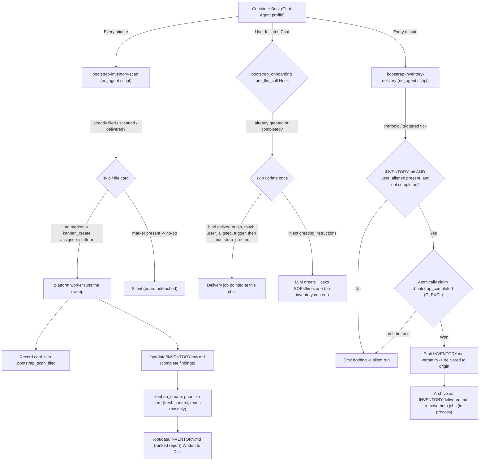
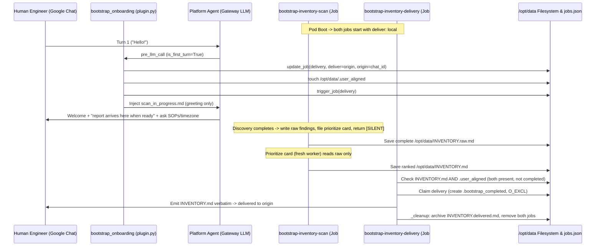

# First-Time Onboarding & Bootstrap (`bootstrap_onboarding`)

This document describes the first-time onboarding and GKE environment-discovery flow. It covers how the flow works for platform engineers and the maintenance conventions and guardrails that future contributors (human or AI) must follow when changing this code.

**The flow lives on the `default` (Chat Agent) profile.** That placement is forced by two constraints introduced with the profile split:

- Every marker that makes onboarding once-only — `.bootstrap_scan_filed`, `.bootstrap_completed`, `INVENTORY.raw.md`, `INVENTORY.md` — lives in the Chat Agent's home, and a job on another profile would gate itself on a different directory.
- The Chat Agent's toolsets are stripped to `mcp-router` + `kanban` (no terminal, gcloud, or kubectl), so it cannot perform the sweep itself.

A third constraint used to be the decisive one: only the `default` profile's cron ticked at all, so a job on `platform` stayed `enabled: true` with `last_run: None` forever. That is fixed — `profile_cron_tick.py` ticks every named profile's store — but the two above still hold.

The sweep is therefore **delegated to the `platform` specialist as a kanban task**, while every piece of onboarding state stays in the Chat Agent's home (`/opt/data`) so both halves read the same files.

---

## 1. System Overview

When a fresh pod starts on a newly onboarded Google Kubernetes Engine (GKE) cluster — or on a new persistent volume (`PVC`) — it runs a deterministic, first-time discovery and onboarding flow made of four parts:

1. **`bootstrap-inventory-scan`** — a `no_agent` cron job on the Chat Agent profile, scheduled `* * * * *`. Because a `no_agent` script is a plain subprocess, it is not bound by the Chat Agent's toolset denylist, but it still cannot reason — so it does not scan. It files a **kanban task assigned to `platform`** carrying the inventory SOP, and that privileged worker surveys the fleet (node pools, networking, Workload Identity, workload SRE posture) and writes the **complete** findings to `/opt/data/INVENTORY.raw.md`. It files that card **once**: the card id is recorded in `/opt/data/.bootstrap_scan_filed`, and while that marker exists the job is a no-op that never touches the board again.
2. **Prioritization** — a second kanban card, filed by the sweep once the raw findings are on disk (`idempotency_key='bootstrap-inventory-prioritize'`). That worker reads `INVENTORY.raw.md` and **nothing else**, scores every finding against the rubric in `inventory_prioritize_sop.md`, registers all of them in the findings queue, and writes the short report the user actually receives to `/opt/data/INVENTORY.md` from the top of the order the queue computes. It does not choose which findings there are: `scripts/inventory_findings.py extract` reads them out of the raw file's machine-readable block and `register` refuses to send anything until every extracted finding carries a score, so the worker cannot register a subset. Ranking is a separate card rather than a final step of the sweep because it must see only the findings: run inline, it would rank them against the sweep's own transcript as well, so the same cluster would yield a different report depending on how the sweep happened to go. The full findings stay on disk, the report still shows at most five items, and where it leaves anything out it ends with a count of what is queued behind it.
3. **`bootstrap-inventory-delivery`** — a `no_agent` cron job, scheduled `* * * * *`. Its script emits `/opt/data/INVENTORY.md` to stdout, which the scheduler delivers **verbatim** to the chat, but only when the report exists _and_ a human has connected — and only after it has atomically claimed the delivery, so two overlapping runs cannot both send it. No LLM is involved in delivery: what prioritization wrote is exactly what the user receives.
4. **`bootstrap_onboarding` plugin** — a `pre_llm_call` lifecycle hook. On the first human turn from a supported durable chat adapter it greets the user, records that a human is present, points the delivery job at this chat, and asks it to fire promptly. Request/response and local surfaces stay silent because they cannot receive a later delivery. The plugin never presents the report itself, and it greets exactly once per deployment.

`INVENTORY.md` is still the single signal that means "ready to deliver" — it now simply appears one stage later. Nothing in the delivery job or the plugin changed when prioritization was added.

### One-time means one time (the guarantee, and where it comes from)

Onboarding is a one-shot event, but its stages become observable at different moments, minutes apart. **Each stage therefore owns a durable marker that it writes at the moment it acts** — not one shared marker written at the end.

That last distinction is the whole design. `.bootstrap_completed` exists only after a report has been _delivered_, which requires both a finished sweep and a human in the chat. Everything before that point can sit unmarked for many minutes — or forever, if the sweep fails. A stage that asks "has onboarding completed?" to decide whether to start is really asking a question whose answer is "no" for the entire window in which it is being re-run every 60 seconds. Ask instead "has _this stage_ already acted?", and each of these is answerable immediately:

| Stage            | Marker written when it acts | What re-runs without it                                                           |
| :--------------- | :-------------------------- | :-------------------------------------------------------------------------------- |
| card filed       | `.bootstrap_scan_filed`     | a fresh fleet-wide sweep filed every minute for the length of the sweep           |
| user greeted     | `.bootstrap_greeted`        | a fresh greeting per new session, each re-pointing delivery at whoever spoke last |
| report delivered | `.bootstrap_completed`      | the full report posted once per overlapping delivery run                          |

Do not replace these with a check on board state, on `INVENTORY.md`, or on `.bootstrap_completed` alone; see Rule 8.

**Prioritization is the one stage without a marker of its own**, and that is a deliberate exception rather than an oversight. The three stages above are each driven by something that re-enters every 60 seconds, which is what makes an unmarked gap expensive. Prioritization is filed by the sweep card — which runs once, behind `.bootstrap_scan_filed` — so its re-entry pressure is a rare board-side retry, not a per-minute tick. It is guarded by its `idempotency_key` plus its own pre-execution check on `INVENTORY.md`, and the worst case if both slip is a duplicated write of the same file from the same input. The user still sees one report, because delivery claims atomically downstream. Give it a real marker if it ever grows a cron trigger.

### Why two jobs? (the load-bearing reason)

The scheduler snapshots a job's delivery destination (`deliver` / `origin`) into memory **when the run starts** (`get_due_jobs` deep-copies `jobs.json`), and delivers the result to that snapshot at the end — it does not re-read the destination from disk after the turn. The scan is long-running and boots with `deliver: local` (no user yet). If the _same_ job also delivered the report, a user who connects mid-scan could not redirect it: their chat is written to disk as `deliver: origin`, but the in-flight scan already cached `deliver: local`, so the report would be lost.

Splitting delivery into a separate, short job fixes this: it starts on a fresh tick _after_ the plugin has written `deliver: origin` to disk, so it reads the correct destination. This separation is mandatory — do not merge the two jobs (see Rule 1).



---

## 2. Coordination State Markers (`/opt/data/`)

The flow coordinates state through flag files under `/opt/data/`:

| Marker                                | Created By                                  | Lifecycle & Purpose                                                                                                                                                                                                                                                                                                                                                                                                             |
| :------------------------------------ | :------------------------------------------ | :------------------------------------------------------------------------------------------------------------------------------------------------------------------------------------------------------------------------------------------------------------------------------------------------------------------------------------------------------------------------------------------------------------------------------ |
| **`/opt/data/.bootstrap_scan_filed`** | `bootstrap_scan_gate.py`                    | Written the moment the sweep card is filed, and contains that card's id. Its presence is what stops the every-minute job filing a second sweep during the many minutes the first one takes. Written only for a card the board confirmed, so a failed create retries on the next tick. Delete it — together with `INVENTORY.raw.md` (see the runbook in §5) — to deliberately re-arm discovery; alone it leaves the gate closed. |
| **`/opt/data/INVENTORY.raw.md`**      | the sweep's `platform` kanban worker        | The complete findings set — every cluster, workload, and recommendation, with no length limit. Never delivered to chat. Its presence means the sweep finished; prioritization may still be running. **It is never cleaned up**, on purpose: it is what a later "show me the full inventory" request is served from. That also means re-arming discovery requires deleting it (see §5).                                          |
| **`/opt/data/INVENTORY.md`**          | the prioritization kanban worker            | The ranked, verbatim-delivered report, written from `INVENTORY.raw.md` alone. Written to this absolute path (not the worker's own profile home) so the chat-side jobs can read it. Its presence means the report is ready to send — unchanged as the delivery signal, it simply arrives one stage later than it used to. Renamed to `INVENTORY.delivered.md` by the delivery script (`_cleanup`) after the report is emitted.   |
| **`/opt/data/.user_aligned`**         | Python, in `plugin.py`                      | Touched in `handle_pre_llm_call` on the first interactive user turn, and only once an origin has been bound. Signals to the delivery job that a human has joined the chat. **Safety rule:** background tasks must never create or write this marker (see Rule 4).                                                                                                                                                               |
| **`/opt/data/.bootstrap_greeted`**    | Python, in `plugin.py`                      | Written after the opening turn has been primed. Every new session's first turn re-enters the hook, so without this the greeting, the presence marker, and the delivery re-binding all repeat per session until a report is finally delivered.                                                                                                                                                                                   |
| **`/opt/data/.bootstrap_completed`**  | `bootstrap_delivery.py` (`_claim_delivery`) | Created with `O_CREAT \| O_EXCL` **before** the report reaches stdout — it is the delivery claim, not a receipt. Whichever run wins the create delivers; any other run exits silently. Its presence also means onboarding is permanently done: the plugin stays quiet and both jobs stay inert even after `INVENTORY.md` has been renamed.                                                                                      |

---

## 3. Operational Cases

Both cases converge on the same delivery path: the `no_agent` delivery job posts `INVENTORY.md` verbatim once the ranked report is on disk and a human is present. The only difference is timing.

### Case A: User engages before the scan completes (mid-scan)

1. **Turn 1 (`pre_llm_call`):** With `is_first_turn=True` and a supported durable chat adapter, the plugin:
   - binds the delivery job to this chat — reads `HERMES_SESSION_PLATFORM` / `HERMES_SESSION_CHAT_ID` / `HERMES_SESSION_THREAD_ID` and calls `update_job("bootstrap-inventory-delivery", {"deliver": "origin", "origin": {...}})` — **before** touching `.user_aligned`, so the job can never fire against a stale target;
   - touches `/opt/data/.user_aligned`;
   - calls `trigger_job("bootstrap-inventory-delivery")` so it fires on the next tick;
   - writes `.bootstrap_greeted` so no later session repeats any of the above;
   - injects `defaults/onboarding/scan_in_progress.md` (a greeting + "the report will arrive here when ready" + a request for SOPs/timezone). It does **not** inject the inventory.

   If the turn is not from a supported durable chat adapter, or no chat origin can be bound, the plugin writes **no** markers and returns `None`: that turn has nowhere to deliver a later report, so onboarding stays armed for the next durable chat turn. `DURABLE_CHAT_PLATFORMS` is a positive allowlist; new adapters must opt in only after implementing persistent delivery.

2. **Delivery job (each tick):** `INVENTORY.md` is still absent → the script emits nothing → silent run.
3. **Scan completes:** the `platform` worker (or the aggregation card it fanned out to) writes `/opt/data/INVENTORY.raw.md` and files the prioritization card. That worker ranks the findings and writes `/opt/data/INVENTORY.md`. The scan job has been skipping this whole time, on `.bootstrap_scan_filed`.
4. **Next delivery tick:** both `INVENTORY.md` and `.user_aligned` exist and `.bootstrap_completed` is absent → the script reads the report, claims delivery by creating `.bootstrap_completed` with `O_EXCL`, prints the report, and the scheduler delivers it verbatim to the bound origin chat. `_cleanup` then archives the report as `INVENTORY.delivered.md` and removes both onboarding jobs.



### Case B: User engages after the scan finished (quiet boot)

1. **Silent completion:** during the unattended boot the scan writes `/opt/data/INVENTORY.raw.md`, the prioritization card ranks it into `/opt/data/INVENTORY.md`, and both return `[SILENT]`. The delivery job stays silent because `.user_aligned` is absent, so the report waits on disk.
2. **Turn 1 (`pre_llm_call`):** the plugin does exactly the same things as in Case A (bind origin → touch `.user_aligned` → trigger delivery → mark `.bootstrap_greeted`) and injects `defaults/onboarding/scan_completed.md` (a greeting + "the full report is being delivered now" + a request for SOPs/timezone).
3. **Next delivery tick:** both files now exist → the script delivers `INVENTORY.md` verbatim to the origin chat and runs `_cleanup`.

The report therefore arrives as its own message shortly after the greeting, identical to Case A — the user always sees the same verbatim report, never an LLM-reformatted one.

```mermaid
sequenceDiagram
    participant Scan as bootstrap-inventory-scan (Job #1, LLM)
    participant Deliver as bootstrap-inventory-delivery (Job #2, no_agent script)
    participant Disk as /opt/data Filesystem
    participant User as Human Engineer (Google Chat)
    participant Hook as bootstrap_onboarding (plugin.py)
    participant Agent as Platform Agent (Gateway LLM)

    Note over Scan: Pod Boot -> Scan writes INVENTORY.raw.md, prioritize card writes INVENTORY.md, both [SILENT]
    Deliver->>Disk: Check .user_aligned -> ABSENT (no human yet) -> silent
    Note over User,Agent: Unattended interval passes...
    User->>Agent: Turn 1 ("Hello!")
    Agent->>Hook: pre_llm_call (is_first_turn=True)
    Hook->>Disk: update_job(delivery, deliver=origin) ; touch .user_aligned ; trigger_job(delivery)
    Hook->>Agent: Inject scan_completed.md (greeting only)
    Agent->>User: Welcome + "full report incoming" + ask SOPs/timezone
    Deliver->>Disk: Claim delivery (create .bootstrap_completed, O_EXCL)
    Deliver->>User: Emit INVENTORY.md verbatim -> delivered to origin
    Deliver->>Disk: _cleanup: archive INVENTORY.delivered.md, remove both jobs
```

---

## 4. Architectural Rules & Implementation Principles (for future maintainers)

When changing onboarding instructions, scripts, or the plugin under `agents/chat/`, follow these guardrails.

### 0. Keep the whole flow on the `default` (Chat Agent) profile

- **Rule:** Do not relocate any part of this flow to `agents/platform/`.
- **Why:** Onboarding's state lives in the Chat Agent's home. A job moved to the platform profile would gate itself on that profile's `HERMES_HOME` instead, so `.bootstrap_scan_filed` would stop being the marker the delivery job and the greeting hook read — and the sweep would re-file, or be delivered twice. (Cron on a named profile does fire now, via `profile_cron_tick.py`; it did not before, and that used to be the reason for this rule.) If a step needs privileged tools, delegate it as a kanban task to `platform` (as the scan does) instead of moving the job.
- **Corollary:** Any file the two halves share must be an absolute path under `/opt/data`. A `platform` worker's `HERMES_HOME` is its own profile home, so a relative path silently lands somewhere the delivery job will never look.

### 1. Keep discovery and delivery in separate jobs (avoids a scheduler race)

- **Rule:** Never merge `bootstrap-inventory-scan` and `bootstrap-inventory-delivery` into one job.
- **Why:** The scheduler caches a job's `deliver`/`origin` in memory at run start and never re-reads it. A long combined job would deliver to whatever destination it snapshotted at boot (`local`), ignoring a `deliver: origin` a user set mid-run — losing the report. The separate delivery job starts on a fresh tick and reads the current destination. (See "Why two jobs?" above.)

### 2. Do cleanup in code, not via LLM terminal commands

- **Rule:** Onboarding cleanup runs deterministically in code — the delivery script's `_cleanup` (`cron.jobs.remove_job`, in-process) — never by instructing the model to run `hermes cron rm` or delete state from a chat turn.
- **Why:** Determinism. A model may forget a step, run the wrong command, or reformat state. (Note: self-removal mid-run is otherwise harmless — the scheduler delivers this run from its cached job dict, and a later `mark_job_run` on a removed job just logs a warning; it does not crash or drop delivery.)

### 3. Verify state with absolute paths, not relative queries

- **Rule:** Scripts and checklists resolve markers under `HERMES_HOME` (`/opt/data`) — e.g. `Path(os.environ.get("HERMES_HOME", "/opt/data")) / "INVENTORY.md"`, or `test -e /opt/data/INVENTORY.md`.
- **Why:** Jobs and turns often run from a subdirectory, so relative or wildcard lookups can miss markers outside the working tree.

### 4. Background tasks must never touch `.user_aligned` (avoids autonomous goal-seeking)

- **Rule:** Only the plugin's `pre_llm_call` (a real human turn) may create `/opt/data/.user_aligned`. The scan and delivery jobs must never write it.
- **Why:** `.user_aligned` is the "a human is present" signal that unlocks delivery. If a background task could forge it, an unattended boot would broadcast the report to nobody and prematurely mark onboarding complete.

### 5. Accept only durable chat delivery inside `pre_llm_call`

- **Rule:** Every scheduled cron run starts a fresh turn loop with `is_first_turn == True`, and request/response surfaces may also look interactive without supporting a later delivery. `handle_pre_llm_call` must require a supported durable chat platform before touching flags or serving prompts:
  ```python
  platform_name = str(kwargs.get("platform", "")).lower()
  session_id = str(kwargs.get("session_id", ""))
  if platform_name == "cron" or session_id.startswith("cron_"):
      return None
  if platform_name not in DURABLE_CHAT_PLATFORMS:
      return None
  ```
  Cron sessions use `platform="cron"` and a `session_id` of the form `cron_<job_id>_<timestamp>`, so either cron check is sufficient. The positive durable-platform check makes all other non-deliverable surfaces fail closed and prevents the greeting from promising a follow-up they cannot receive.

### 6. Enable native multi-chunk delivery (`splits_long_messages`)

- **Rule:** `register(ctx)` sets `GoogleChatAdapter.splits_long_messages = True`.
- **Why:** The delivery router (`gateway/delivery.py`) truncates messages over `MAX_PLATFORM_OUTPUT` (4000 chars) with a `... [truncated, ...]` footer unless the adapter declares `splits_long_messages`. `GoogleChatAdapter` chunks long text in its `send()` (via `_chunk_text`) but does not declare the flag, so without this a long `INVENTORY.md` would be truncated before it reaches `send()`. The prioritized report is written to fit inside 4000 chars, so this no longer fires on the happy path — keep it anyway. It still covers a report that runs long because the sweep found a lot that is genuinely broken, and it covers the full-inventory reply a user can ask for afterward, which is not length-limited at all.

### 7. The two inventory files have opposite obligations

- **Rule:** `INVENTORY.raw.md` (written by `governance/inventory.md`) must be **complete**: full fleet and workload tables, every recommendation, no placeholders, no trimming for length, and a ```findings block carrying one line per affected object. That block is what prioritization registers, so a problem named only in the prose plan is invisible to the queue. `INVENTORY.md` (written by `governance/inventory_prioritize_sop.md`) must be **short and self-contained**: a ranked selection, a roll-up count of what it left out, and under 4000 chars.
- **Why:** Whichever file is wrong costs something different. Trim the raw file and the finding is gone for good — prioritization reads that file and nothing else, so an omission there is invisible for the rest of onboarding and for any later full-inventory request. Pad the report and the user is back to the wall of text this stage exists to prevent.
- **Corollary:** Prioritization must not re-run discovery, and must not add findings the sweep did not record. Its input is one file. A report that describes something absent from `INVENTORY.raw.md` was invented.

### 8. Every once-only step writes its own marker, at the moment it acts

- **Rule:** A stage that must happen once decides by reading a marker it owns and writes at the instant it acts — never by inferring from board state, from `INVENTORY.md`, or from `.bootstrap_completed` alone. Where two runs can race (delivery), the marker must be _claimed_ atomically (`O_CREAT | O_EXCL`) before the side effect, not written after it.
- **Why:** This is the bug the flow shipped with, and it is easy to reintroduce because the wrong version reads correctly. Both onboarding jobs run every 60 seconds while the work they guard takes minutes, so any gap between "acted" and "observably finished" is re-entered dozens of times.
  - The scan gate skipped only on `INVENTORY.md` / `.bootstrap_completed`, neither of which exists during the sweep, and leaned on the board's `idempotency_key`. When the sweep began delegating to subagents, the filed card started completing almost immediately (its job is to fan out, not to scan), so for the whole run the board said "done" and the disk said "no report" — and the gate re-filed a fleet-wide sweep every minute.
  - The plugin greeted on any first turn without `.bootstrap_completed`. Every new session sets `is_first_turn=True`, so a second user or a new thread re-greeted and re-pointed the delivery job at itself.
  - Delivery checked `.bootstrap_completed` and wrote it after emitting, leaving a window in which a scheduled tick and a `trigger_job` run could both send the report.
- **Corollary:** Do not treat an upstream dedupe (kanban's `idempotency_key`) as the guarantee. It is a useful backstop for the narrow window where a marker write fails, but it dedupes against non-archived rows in one board's database — an archived card, a rebuilt board, or a reset volume turns it back into no protection at all.

---

## 5. Quick Diagnostic Commands

Check the active markers in a live pod:

```bash
POD_NAME=$(kubectl get pods -n kubeagents-system -l app=platform-agent-gateway -o jsonpath='{.items[0].metadata.name}')
kubectl exec -n kubeagents-system ${POD_NAME} -c platform-agent -- ls -la --full-time /opt/data/INVENTORY.raw.md /opt/data/INVENTORY.md /opt/data/.bootstrap_scan_filed /opt/data/.user_aligned /opt/data/.bootstrap_greeted /opt/data/.bootstrap_completed 2>/dev/null || echo "All onboarding markers cleared"
```

If onboarding has stalled, `.bootstrap_scan_filed` names the card to inspect:

```bash
kubectl exec -n kubeagents-system ${POD_NAME} -c platform-agent -- cat /opt/data/.bootstrap_scan_filed
```

`INVENTORY.raw.md` is where a stalled sweep shows itself: present means the sweep finished and prioritization is the stage that has not.

To deliberately re-run discovery, remove the markers for the stages you want to repeat (`.bootstrap_scan_filed` to re-file the sweep, `.bootstrap_greeted` to re-greet, `.bootstrap_completed` to allow another delivery). **`INVENTORY.raw.md` must go too** — unlike the report, nothing ever cleans it up, and the scan gate skips while it exists, so clearing only `.bootstrap_scan_filed` leaves discovery permanently disarmed:

```bash
kubectl exec -n kubeagents-system ${POD_NAME} -c platform-agent -- rm -f /opt/data/INVENTORY.raw.md /opt/data/INVENTORY.md /opt/data/.bootstrap_scan_filed /opt/data/.bootstrap_greeted /opt/data/.bootstrap_completed
```

**Once a report has been delivered, clearing markers is not enough.** `_cleanup` removes both
onboarding cron jobs after a successful delivery, so there is nothing left to fire and a marker
reset produces silence. Check with `grep bootstrap /opt/data/cron/jobs.json` inside the pod; if the jobs are gone, either
re-add them or skip the gate entirely and file the sweep card yourself:

```bash
BODY=$(python3 -c "import sys; sys.path.insert(0,'agents/chat/scripts'); import bootstrap_scan_gate as g; print(g._task_body())")
hermes kanban create --assignee platform --idempotency-key bootstrap-inventory-scan-rerun-$(date +%s) \
  --body "$BODY" "First-time environment discovery: write the onboarding inventory report"
```

The key must be fresh. `_cleanup` renames the report and removes the cron jobs, but it never touches
the board, so the original `bootstrap-inventory-scan` card is still there (completed) — and the board
answers a repeated key by returning that card's id and spawning nothing. Reusing the original key in
this runbook is a silent no-op.

Filing directly is also the better option for measurement: it starts the clock at card creation
rather than at the next cron tick, removing up to 60 seconds of scheduling latency from any timing.

To re-rank without re-scanning the fleet, delete `INVENTORY.md` and `.bootstrap_completed` but keep `INVENTORY.raw.md`, then re-file the prioritization card by hand — again under a fresh key, for the same reason:

```bash
hermes kanban create --assignee platform --idempotency-key bootstrap-inventory-prioritize-rerun-$(date +%s) \
  --body "Follow the prioritization SOP, reading whichever of these exists: /opt/data/profiles/platform/governance/inventory_prioritize_sop.md or /opt/platform-template/governance/inventory_prioritize_sop.md. Read /opt/data/INVENTORY.raw.md as your only input and write the ranked report to /opt/data/INVENTORY.md." \
  "Prioritize the onboarding inventory report"
```

A previously delivered report is kept at `/opt/data/INVENTORY.delivered.md` and can be re-sent without re-running either stage.

Review onboarding hook and delivery events in the agent logs:

```bash
kubectl exec -n kubeagents-system ${POD_NAME} -c platform-agent -- grep -E "bootstrap_onboarding|Bound bootstrap-inventory-delivery|Marked .*user_aligned|bootstrap_delivery|bootstrap_scan_gate" /opt/data/logs/agent.log
```

---

## 6. Tests

Unit tests cover the deterministic pieces of the flow (they mock the Hermes
`cron.jobs` / `gateway.session_context` APIs, so no running gateway is needed):

- `test_plugin.py` — the `pre_llm_call` state machine: durable-platform,
  cron/first-turn/completed gating, greeting exactly once across sessions, origin binding before
  `.user_aligned` (and no markers at all when nothing can be bound), the
  delivery trigger, and that the inventory is never injected into the turn.
- `../../../scripts/test_bootstrap_onboarding_scripts.py` — the delivery
  decision, the atomic claim and verbatim emit/archive, the scan job's
  file-once-then-skip behaviour across repeated ticks, and the prioritization
  handoff: that the sweep card hands ranking to a separate card rather than
  doing it inline, and that the raw and delivered paths never collapse into one.

Each once-only step is covered twice: once for acting, once for refusing to act
again (Rule 8).

Run from the repository root:

```bash
python3 -m unittest discover -s agents/chat/defaults/plugins/bootstrap_onboarding -p 'test_*.py'
python3 -m unittest agents.chat.scripts.test_bootstrap_onboarding_scripts
```
