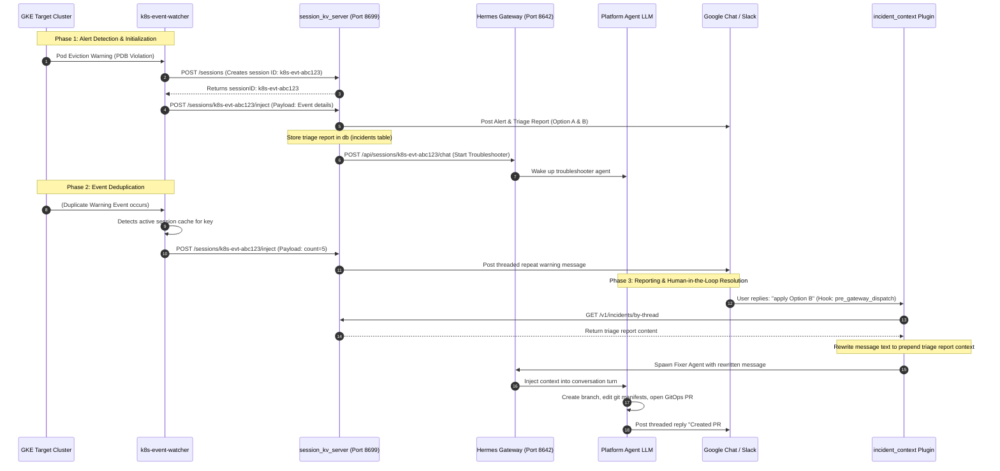

# Platform Session Management & Incident Triage Flow

This document details the architecture and workflow for routing GKE Kubernetes warning alerts into persistent diagnostic agent sessions, enabling interactive threaded troubleshooting in chat platforms (Google Chat and Slack).

---

## Architecture Overview

AI agent execution is typically stateless and triggered on-demand. To support proactive GKE warning troubleshooting, we run a local stateful proxy server called `session_kv_server.py` (the REST Bridge) on the Platform Agent host on port `8699`.

This server acts as a bridge between the **GKE Event Watcher** (monitoring target clusters) and the **Platform Agent Gateway** (running the LLM reasoning turns).

### Key Responsibilities:

1. **Deduplication:** Maps repeat events to the same troubleshooting session, preventing alert flooding and saving LLM token costs.
2. **Dynamic Thread Resolution:** Captures the Chat API message ID returned from the first alert, saving it as the persistent thread key.
3. **Incident Triage Context Preservation:** Persists completed triage reports inside the local SQLite database.
4. **Gateway Message Rewriting Hook:** Integrates the `incident_context` plugin to intercept user replies on active incident threads and automatically prepend the triage report, allowing the fixer agent session to run with full context.

---

## End-to-End Workflow

The diagram below details the lifecycles of alert ingestion, session routing, and interactive GitOps fixes:



---

## Database Schemas & Storage

Session and incident data are stored in a local SQLite database inside the Platform Gateway pod:

```text
/var/lib/kube-agents/session/session_kv.db
```

### Table Schemas

#### `session_metadata`

Stores the mapping between the troubleshooter session and the platform chat thread:

```sql
CREATE TABLE session_metadata(
  session_id TEXT PRIMARY KEY,
  metadata TEXT NOT NULL,         -- JSON object storing platform, chat_id, thread_id, and timestamps
  updated_at TIMESTAMP DEFAULT CURRENT_TIMESTAMP
);
```

#### `incidents`

Stores the triage report context for active incident threads:

```sql
CREATE TABLE incidents(
  chat_id TEXT,
  thread_id TEXT,
  report TEXT NOT NULL,
  updated_at TIMESTAMP DEFAULT CURRENT_TIMESTAMP,
  PRIMARY KEY (chat_id, thread_id)
);
```

---

## Verification & Troubleshooting

### Check Persisted Incidents

To view currently registered incident triage reports:

```bash
kubectl -n kubeagents-system exec deployment/platform-agent-gateway -c platform-agent -- \
  sqlite3 /var/lib/kube-agents/session/session_kv.db "SELECT chat_id, thread_id, updated_at FROM incidents;"
```

### Verify Inbound Plugin Activity

Filter container logs to trace whether the `incident_context` plugin is successfully intercepting threads and rewriting messages:

```bash
kubectl -n kubeagents-system logs deployment/platform-agent-gateway -c platform-agent | grep -E "incident_context|inbound message"
```
