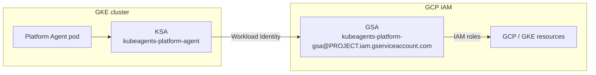

## What the agent can and cannot do

This is the canonical answer. Other pages summarize it and link here; if they appear to disagree, this page is correct.

"Is the agent read-only?" has **three different answers depending on which plane you mean.** Conflating them is the most common misreading of this project's security posture.

| Plane                         | What it governs                                                   | Can the agent write?                                                                                                                                                                                                                 |
| ----------------------------- | ----------------------------------------------------------------- | ------------------------------------------------------------------------------------------------------------------------------------------------------------------------------------------------------------------------------------ |
| **Kubernetes RBAC** (the KSA) | Everything the agent does against a cluster's Kubernetes API      | **No** for workloads and cluster state — read-only in every configuration apart from a leader-election housekeeping Role confined to its own namespace, and it cannot read Secrets. Enforced by RBAC.                                |
| **GCP IAM** (the GSA)         | GKE/Google Cloud control-plane calls, including via the `gke` MCP | **No, with the default `read-only` permission set** — the only other set the install offers is `custom`, whose roles you choose yourself. Enforced by IAM, chosen at install time.                                                   |
| **The GitOps path**           | Changes to your infrastructure-as-code repository                 | Yes — by opening a pull request a human must review and merge. Enforced by the credential proxy, which refuses the agent the GitHub write verbs (merge, approve, REST mutation, workflow and release triggers, repo administration). |

### What that means in practice

- **Workloads and cluster state cannot be mutated through the Kubernetes API by this agent.** The KSA's only write grant is the housekeeping Role `kubeagents:leader:<namespace>:<name>` — write on leader-election `leases`, confined to the agent's own namespace, plus `get`/`patch` on `pods` there **only when the deployment runs more than one replica** (`spec.deployment.availability.replicas`), which is when the leader-election wrapper that labels its own pod actually runs. On the default single-replica install the Role grants `leases` alone. Beyond that it holds no write verb (see [Kubernetes RBAC](#kubernetes-rbac)). No other setting widens this.
- **GCP control-plane mutation is enforced off by default.** The default `read-only` permission set gives the GSA viewer roles only, so cloud-side writes fail at IAM. The install no longer offers an admin bundle — `custom` is the only way to widen this, and it requires you to name every role. If you do grant write roles that way, the agent's `gke` MCP server proxies `container.googleapis.com` and exposes cluster-management tools, and what stops the agent using them is its **persona** (`SOUL.md §1`, "automation first" — infrastructure changes go through Git), not a permission boundary.
- **Persona rules are guidance, not enforcement.** A prompt-injection or reasoning failure is bounded by IAM, not by `SOUL.md`. Keep the default `read-only` set if "read-only on the cloud plane" must be an enforced property of the deployment rather than an intended behaviour of the model (see [Configuring read-only mode](#configuring-read-only-auditing-mode)).
- **The intended write path is always GitOps** — the agent proposes, a human merges, your reconciler applies. The second half is enforced rather than intended: the credential proxy refuses `gh pr merge`, `gh pr review --approve`, mutating `gh api` calls, workflow and release triggers, and repository administration, so the actor that opens a pull request cannot also complete it. See [Secure write path](#secure-write-path-gitops) and [Credential isolation](/kube-agents/reference/credential-isolation/) for the rule ids.
- **The chat front door holds no infrastructure tools at all.** Chat ingress terminates at the Planning Agent (the pod's `default` Hermes profile), whose config pins every surface to routing, kanban-delegation, and per-user memory tools only — no GKE, file, or GitOps write tools. A prompt injected through chat must still be delegated to the Platform Agent, where the IAM and RBAC boundaries above apply. The experimental [`platformFrontDoor`](/kube-agents/operator/platformagent-crd/#platformfrontdoor) flag gives that up on purpose: it points chat ingress straight at the Platform Agent's toolset, so this row does not hold on an install that has turned it on. It also hands that profile's `config.yaml` to the agent, so the security and approval keys in it (`security.tirith_enabled`, `approvals.*`) stop being restored from the image on every restart. It is off by default and unsupported. See [ChatOps](/kube-agents/concepts/chatops/).
- **Cluster Agents are scoped-down, not scoped-up.** Each per-cluster [Cluster Agent](/kube-agents/concepts/cluster-agents/) profile shares the pod's identity (same KSA/GSA, so the same IAM and RBAC ceilings apply), but its config template exposes only the read-only `gke` and `developer_knowledge` MCP servers — no `platform_control`, no GitOps write path — and its `KUBECONFIG` is pinned to one cluster. It proposes fixes back over the kanban card; only the Platform Agent can turn them into PRs.
  - **The management cluster now has a Cluster Agent too,** so one of these profiles is scoped to the cluster kube-agents itself runs in and can read the harness's own namespace — including the namespace holding `platform-agent-secrets`. **How far that reach goes is set by the GSA's permission set, not by the Kubernetes RBAC row above.** A Cluster Agent does not reach its cluster as the KSA: `cluster_agent_profile.create_profile` runs `gcloud container clusters get-credentials` and pins the resulting kubeconfig, so its Kubernetes API calls authenticate as the pod's GSA and the `kubeagents:minimal:*` ClusterRole does not bound them. (On an install that has armed the [scoped service account pool](#the-scoped-service-account-pool), `kubectl` under such a kubeconfig authenticates as the cluster's pool member instead — moot today, since the pool is suspended and off by default.) On the default `read-only` set (`roles/container.clusterViewer`, `roles/container.viewer`) that means the harness's own workloads, their logs, ConfigMaps and events, and **not** its Secrets. On a `custom` set that names an admin role it means the full Kubernetes API on that cluster, **Secrets included** — so on such an install this profile can read the agent's own credentials. That reach is accepted on purpose on the default set: the management cluster's workloads fail like any other cluster's, and the agent that triages an event has to be the one scoped to the cluster that raised it. If it is not acceptable on your install — most sharply if you have widened the GSA through `custom` — add the cluster's name to [`spec.scope.exclude.clusters`](/kube-agents/operator/platformagent-crd/#specscope) on the `PlatformAgent` (naming the cluster by project, location and name; the older `RECONCILE_EXCLUDE` bare-name variable still works for one release); the next reconcile then prunes the profile. That removes the Cluster Agent and, with it, `stall-watch`'s reads of that cluster, which follow the same profile roster; the fleet audits still sweep every running cluster in the project, the management cluster included, and have no per-cluster exclusion.

> The [end-state design](https://github.com/gke-labs/kube-agents/blob/main/docs/architecture/01-vision-scope.md) goes further: agents stay read-only on cloud APIs in every configuration, and the `create_cluster` tool is withdrawn. Removing the `gke-admin` bundle closed the one-word path to a writable GSA, but it does not get there on its own — `custom` can still be pointed at admin roles, and the tool is still present. That part is a target, not current behaviour.

---

The rest of this page details the two enforced planes.

## Identity model

The agent uses [GKE Workload Identity](https://cloud.google.com/kubernetes-engine/docs/how-to/workload-identity) to bind its in-cluster KSA to a GSA, so no static GCP key ever lands in the cluster.



The IAM side of the binding is provisioned by the [`kube-agents-iam` Terraform module](https://github.com/gke-labs/kube-agents/tree/main/terraform/modules/kube-agents-iam) (instantiated by the `terraform/examples/full-install` composition the installer drives), which grants `roles/iam.workloadIdentityUser` on the GSA to the KSA member `<project>.svc.id.goog[kubeagents-system/kubeagents-platform-agent]` (the KSA half is the composition's `agent_ksa_name`, `kubeagents-platform-agent` by default). The KSA-side annotation `iam.gke.io/gcp-service-account: kubeagents-platform-gsa@<project>.iam.gserviceaccount.com` is applied by the operator from `spec.security.serviceAccountAnnotations` on the [`PlatformAgent` CR](/kube-agents/operator/platformagent-crd/).

### The shell sandbox uses federation instead

GKE resolves Workload Identity by Pod IP, so every container in a Pod shares one cloud identity — including a credential proxy sitting beside the agent's shell. The shell sandbox Pod therefore runs under its own KSA, `<agent>-shell`, with **no** `iam.gke.io/gcp-service-account` annotation: the metadata server answers it with an unbound `<project>.svc.id.goog` principal that no IAM policy names. When `spec.security.workloadIdentityFederation` is set, the credential proxy in that Pod gets an audience-scoped projected token mounted in its container alone and exchanges it through [Workload Identity Federation](https://cloud.google.com/iam/docs/workload-identity-federation) for an impersonated `kubeagents-platform-gsa` token. Mounts are per-container where Pod identity is not.

The chart turns this on with `platformAgent.harness.experimental.shellSandbox.enabled` and `platformAgent.security.workloadIdentityFederation`, but nothing creates the pool itself — not the chart, not the provisioning scripts, not the Terraform modules. The one-time `gcloud` commands are in [`designs/agent-shell-sandboxing.md`](https://github.com/gke-labs/kube-agents/blob/main/docs/designs/agent-shell-sandboxing.md#setting-up-the-pool).

## GCP IAM permission sets

The install grants the agent GSA one of two permission sets. Both entry points choose from the same vocabulary, and `read-only` is the default in each: the installer asks the question — or takes `--permission-set` / `--custom-roles` — and records the answer in `install.env` as `PLATFORM_AGENT_PERMISSION_SET` before generating `terraform.tfvars`; a hand-driven Terraform composition takes the same two values in its `permission_set` variable, with `custom` requiring a `project_roles` list (setting `project_roles` explicitly overrides `permission_set` either way).

| Permission set | `PLATFORM_AGENT_PERMISSION_SET` | Use it when                                                   |
| -------------- | ------------------------------- | ------------------------------------------------------------- |
| **read-only**  | `read-only` (default)           | Auditing / monitoring only — no GCP write capability.         |
| **custom**     | `custom`                        | You supply the exact roles via `PLATFORM_AGENT_CUSTOM_ROLES`. |

### Roles per set

The default **read-only** set binds viewer roles only:

- `roles/container.clusterViewer`, `roles/container.viewer` — read-only GKE.
- `roles/compute.viewer` — read-only compute, reservations, machine types, and quota advice.
- `roles/monitoring.viewer`, `roles/logging.viewer` — read-only telemetry.
- `roles/iam.serviceAccountUser` — act as service accounts when running jobs.
- `roles/iam.securityReviewer` — read IAM policy for review.
- `roles/mcp.toolUser` — call the GKE MCP server.
- `roles/serviceusage.serviceUsageConsumer` — consume API quota for Developer Knowledge MCP queries.

`roles/container.viewer` is project-wide and unconditioned, so it reads Kubernetes objects in **every** cluster in the project. The [scoped service account pool](#the-scoped-service-account-pool) is where that narrowing is designed to land — suspended, so today nothing narrows it; the pool section says why. A binding on a folder or organisation named in [`spec.scope`](/kube-agents/operator/platformagent-crd/#specscope) is inherited by every project beneath it, which is what makes a container worth declaring and also what a grant there reaches.

The **custom** set binds exactly the roles listed in `--custom-roles` (space- or comma-separated; the installer prompts for it and requires a non-empty value when this set is selected), carried as the composition's `project_roles` list — none of the built-in role bundles are added.

If that list names a role like `roles/container.admin`, the installer says so at the point of choice — it is the authority the removed bundle granted, reached the long way round — and continues. It is your call to make, not the installer's.

### Why there is no `gke-admin` set

There used to be a third set, `gke-admin`, which bound `roles/container.clusterAdmin` and `roles/container.admin`. It was removed rather than deprecated because it did not simply widen the ceiling — it removed one:

- **GKE authorizes an action if _either_ IAM or Kubernetes RBAC allows it** ([Access control](https://docs.cloud.google.com/kubernetes-engine/docs/how-to/role-based-access-control)). A GSA holding `roles/container.admin` is authorized by IAM whatever the KSA's RBAC says, so the read-only Kubernetes footprint below stops constraining anything the agent reaches through that identity.
- **`roles/container.admin` is the one predefined GKE role that carries `container.clusters.impersonate`** — `roles/container.clusterAdmin` does not. GKE grants IAM roles at the project level; a cluster is not a resource an IAM policy attaches to, so "an IAM role grants privileges across all clusters in the project". The impersonation therefore cannot be narrowed to one cluster.

`custom` remains, so a deployment that genuinely needs broad roles still has a supported path — it just has to name each role, which makes the grant explicit and reviewable. Setting `PLATFORM_AGENT_PERMISSION_SET=gke-admin`, or `permission_set = "gke-admin"` in `terraform.tfvars`, now fails with an error rather than being silently downgraded. Re-running the install does not strip roles it no longer grants, so an existing GSA has to be brought back by hand — see below.

## The scoped service account pool

:::caution[Grants nothing today]
The pool provisions its service accounts, and those accounts hold no IAM grant. Each was scoped by an IAM Condition on the cluster's `resource.name`, and that grants nothing for Kubernetes object operations — measured across four condition spellings, one of which asserted only that the call was a GKE call. Deleting the condition is not the repair: un-conditioned, the same binding is project-wide `roles/container.viewer`, which is the ceiling the pool exists to remove. Both are gone.

So the pool is empty by default and the broker runs on the agent's own identity, as it did before. There are two ways to arm it and both should stay off: `scoped_clusters` on the Terraform side, and `platformAgent.security.scopedServiceAccounts` in the chart, which is what an install that writes the `PlatformAgent` CR by hand would set. Authority arrives with per-cluster Kubernetes RBAC, which is a separate change.
:::

A Terraform install can provision one service account per GKE cluster. The credential broker then mints a short-lived token for the account a `kubectl` request's target cluster maps to, rather than running it on the agent's own identity.

Set it with the `scoped_clusters` variable, on the [`kube-agents-iam`](https://github.com/gke-labs/kube-agents/blob/main/terraform/modules/kube-agents-iam) module or on `terraform/examples/full-install`, which passes it through. A non-empty list provisions the accounts and arms the broker. A cluster that is not in the list is then refused rather than served by a wider credential, so adding a cluster to the fleet without adding it here produces a refusal naming the missing scope.

The narrowing that was to go with it is suspended. The agent's own GSA was to drop `roles/container.viewer` whenever the pool was populated, keeping `roles/container.clusterViewer` — able to enumerate clusters and run `get-credentials`, unable to read anything inside one. The two changes are coupled because neither is safe alone: narrowing the agent while the pool grants nothing breaks every read, and arming the pool while the agent stays wide leaves the ceiling the pool exists to remove. Both are off, and a test holds the two halves together.

The module grants the agent `roles/iam.serviceAccountTokenCreator` **on each pool member as a resource**, never at project level. At project level that role would let the agent mint a token for any service account in the project, which would make the pool decorative.

The mapping reaches the broker through `spec.security.scopedServiceAccounts` on the [`PlatformAgent` CR](/kube-agents/operator/platformagent-crd/). The operator renders it into the credential-proxy ConfigMap and sets `CREDENTIAL_PROXY_SCOPED_SA_POOL` on the broker container. That variable is written in both directions, so which credential mode an install is in is readable from the Deployment rather than inferred from what is absent.

**What the pool does not cover.** It scopes `kubectl`, and only `kubectl`, through the credential broker. `gcloud` also goes through the broker but stays on the agent's own identity — it names its target in argv, and deciding scope from argv would put a parser where the boundary belongs — and so do `git` and `gh`. And the `gke` MCP server proxies to `container.googleapis.com/mcp` from the agent container on the ambient Workload Identity credential and never reaches the broker at all. What bounds both of those paths is the size of the agent's own grant — which is the other half of why `roles/container.viewer` was to come off it.

## Kubernetes RBAC

Independently of the GCP permission set, the operator grants the agent KSA a **read-only** footprint on the Kubernetes API, plus one namespaced housekeeping Role. It creates three bindings (see [`platformagent_manifests.go`](https://github.com/gke-labs/kube-agents/blob/main/k8s-operator/internal/controller/platformagent_manifests.go)):

| Binding                                 | Role                       | Grants                                                                                                                                                              |
| --------------------------------------- | -------------------------- | ------------------------------------------------------------------------------------------------------------------------------------------------------------------- |
| `kubeagents:minimal:<namespace>:<name>` | custom minimal ClusterRole | Cluster-wide read access (`get`/`list`/`watch`) to audit resources (nodes, pods, deployments, configmaps, services, etc.) — **excluding Secrets and RBAC**.         |
| `kubeagents:local:<namespace>:<name>`   | custom namespaced Role     | Read access (`get`/`list`/`watch`) to `PlatformAgent` CRs in the agent's **own namespace only**.                                                                    |
| `kubeagents:leader:<namespace>:<name>`  | custom namespaced Role     | Housekeeping in the agent's **own namespace only**: write on `coordination.k8s.io` `leases` (leader election), plus `get`/`patch` on `pods` only above one replica. |

For the default CR (`platform-agent` in `kubeagents-system`) the bindings resolve to `kubeagents:minimal:kubeagents-system:platform-agent`, `kubeagents:local:kubeagents-system:platform-agent`, and `kubeagents:leader:kubeagents-system:platform-agent`.

The Kubernetes `minimal` and `local` roles carry no write verbs (`create`, `update`, `patch`, `delete`) and grant no read access to Secrets or cluster RBAC. (The GCP IAM `read-only` permission set independently provides cluster-viewer read via Cloud IAM for audits connecting through `gcloud container clusters get-credentials`.) The only write grant anywhere in Kubernetes RBAC is the `leader` Role, and it is confined to the agent's own namespace — leader-election `leases`, plus `get`/`patch` on `pods` there when the deployment resolves to more than one replica (the leader labels its own pod so the Service routes to it; at one replica that code never runs and the rule is not rendered). The count that matters is the effective one: `spec.deployment.scaleToZero: true` resolves to zero regardless of `spec.deployment.availability.replicas`, so it renders no `pods` rule either. The agent cannot modify Deployments, Services, or namespaces, and it cannot read Secret values — if a resource it proposes needs a Secret, it references the Secret by name rather than reading its contents.

Verify the bindings on a running cluster:

```bash
kubectl describe clusterrolebinding kubeagents:minimal:kubeagents-system:platform-agent
kubectl describe rolebinding -n kubeagents-system kubeagents:local:kubeagents-system:platform-agent
kubectl describe rolebinding -n kubeagents-system kubeagents:leader:kubeagents-system:platform-agent
```

### The admission backstop on agent RBAC

The RBAC above is what the operator creates. Alongside it, two cluster-scoped `ValidatingAdmissionPolicy` objects reject some agent RBAC at apply time, whoever applies it. One source, [`k8s-operator/config/admission/agent-rbac-policy.yaml`](https://github.com/gke-labs/kube-agents/blob/main/k8s-operator/config/admission/agent-rbac-policy.yaml), and which installs apply it depends on how you install:

| Install method                                                                | Ships the policies?                                                                                                                                     |
| ----------------------------------------------------------------------------- | ------------------------------------------------------------------------------------------------------------------------------------------------------- |
| The install engine — `install.sh`, or Terraform + Helm directly (Methods 0/1) | **Yes on Kubernetes 1.30+** — `templates/agent-rbac-admission-policy.yaml`, gated on `admissionPolicy.enabled` (default on) and on the cluster version. |
| Manual `make install && make deploy` (Method 2)                               | **No** — apply the source yourself; INSTALL.md Method 2 Step 4 has the command.                                                                         |

They are outside the kustomize overlay on purpose: its `namePrefix` rewrites each policy's name but not the `spec.policyName` its binding refers to, which would leave the bindings pointing at nothing and the policies inert with no error. A plain `kubectl apply` has no such transform.

They need Kubernetes 1.30 or later, where the policy API reached `v1`. The chart template checks the cluster's version as well as the values gate, so on 1.29 it renders nothing rather than failing the install — which also means an install there is not backstopped at admission and nothing says so at the time.

**What they govern is narrower than "agent RBAC", and the gap is worth knowing before you rely on them.** Policy 1 selects only objects carrying the `kube-agents/tier` label. Nothing the operator creates carries it — the operator stamps the four `app.kubernetes.io/*` labels and no tier — so on a default install with no GitOps overlay, **policy 1 matches nothing at all**. It is a backstop on the RBAC your overlay writes, not on the RBAC the operator mints. Policy 2 does see the operator's `kubeagents:minimal:*` ClusterRoleBinding, whose subject ends in `-agent`, and deliberately exempts it: the operator has no namespace-tier path, so the one case policy 2 denies is one it cannot produce.

| Policy                            | Governs                                                                          | Denies                                                                                                             |
| --------------------------------- | -------------------------------------------------------------------------------- | ------------------------------------------------------------------------------------------------------------------ |
| `kube-agents-agent-readonly`      | `Role` / `ClusterRole` labelled `kube-agents/tier`                               | Any verb outside `get`/`list`/`watch`; any rule reaching `secrets`; a `ClusterRole` for the `developer-team` tier. |
| `kube-agents-agent-binding-scope` | `RoleBinding` / `ClusterRoleBinding` whose subject is a `*-agent` ServiceAccount | A `ClusterRoleBinding` to `developer-team-agent`.                                                                  |

What they do **not** cover, stated plainly because a backstop misread as complete is worse than none:

- **They cannot check the role a binding points at.** CEL in a `ValidatingAdmissionPolicy` sees only the object being admitted, so an unlabelled write `Role` bound to an agent ServiceAccount is admitted. Closing that needs a cross-object webhook, which is not built.
- **The content policy is label-selected.** `kube-agents-agent-readonly` only looks at objects carrying `kube-agents/tier`. A hand-written manifest that omits the label is not examined at all; pull-request review is what catches that. The binding-scope policy is not evadable that way: it keys on the ServiceAccount being privileged, which the binding cannot omit. Nor by _adding_ something — its one exemption, for the operator's own reconcile, matches on `request.userInfo.username`, which the API server fills in from the authenticated request and no manifest can carry. That distinction is load-bearing rather than pedantic: `matchConditions` are ANDed, so a false one drops the object from the policy altogether, and an exemption an author could satisfy from inside the manifest would be a bypass of the whole rule rather than a carve-out from it.
- **Policy 2 denies exactly one ServiceAccount name.** A cluster-scoped binding to any other agent ServiceAccount is admitted. Combined with the label point above, this means an unlabelled `ClusterRole` granting `*` on `*`, bound to the agent's own ServiceAccount, is admitted by both policies on a default install. Pull-request review on the GitOps repository is the control for that, which is what the [branch-protection guidance](https://github.com/gke-labs/kube-agents/blob/main/examples/gitops-repo/.github/branch-protection.md) shipped with the example overlay is for.
- **Policy 2 only examines `kind: ServiceAccount` subjects.** A binding whose subject is a `kind: Group` — `system:serviceaccounts:team-x`, say — is not selected. The subject is unforgeable for the kinds the policy looks at; choosing a different kind steps outside them.
- **They govern agent RBAC, not the operator's own.** The controller's ClusterRole below is unlabelled and out of scope by design.

### The operator controller is a separate identity

Everything above describes the _agent_. The controller-manager that reconciles `PlatformAgent` CRs runs under its own KSA, `kubeagents-controller` (the kustomize `namePrefix: kubeagents-` applied to the base `controller` ServiceAccount), and its Kubernetes permissions are the Kubebuilder-generated ClusterRole in [`k8s-operator/config/rbac/role.yaml`](https://github.com/gke-labs/kube-agents/blob/main/k8s-operator/config/rbac/role.yaml) (regenerated with `make manifests`): write access to the object kinds it reconciles for the agent pod — Deployments/StatefulSets, ServiceAccounts, Services, ConfigMaps, PVCs, NetworkPolicies, PodDisruptionBudgets, and the agent RBAC objects above — plus, for the `mode: next` A2A stack, Secrets (the generated NATS credentials and config — by name only: the controller holds no `list` or `watch` on Secrets, so it cannot enumerate them), `batch` Jobs (the bus provisioning run), and ResourceQuotas (the session-pod bound) — plus read-only access to what it merely watches (nodes, namespaces, CRDs, RuntimeClasses). On every install, not only under `mode: next`, the controller also **reads the values** of the Secret keys the agent pod consumes as environment, and digests them onto the pod template so that rotating one rolls the pod ([PlatformAgent CRD](/kube-agents/operator/platformagent-crd/#rotating-a-secret-rolls-the-pod)); which Secrets those are is decided by the rendered pod spec, so a CR-supplied or plugin-supplied `SecretKeyRef` widens it to that Secret too. Those reads are by name and uncached like the rest, the digest is an HMAC-SHA256 keyed by the UIDs of the Secrets it reads from so the annotation cannot be used to verify guesses at a value, and the `list`/`watch` ceiling is unchanged — the controller still cannot enumerate Secrets, and [`tests/test_operator_secrets_grant.py`](https://github.com/gke-labs/kube-agents/blob/main/tests/test_operator_secrets_grant.py) fails if that changes. The controller verifies at startup, and every five minutes after on its own ticker, that the role bound to it grants every permission the `+kubebuilder:rbac` markers that generate `role.yaml` declare, and reports a shortfall as a `Degraded`/`RBACIncomplete` condition on each `PlatformAgent` — the signature of an image deployed ahead of its manifests; the [operator page](/kube-agents/operator/#an-image-ahead-of-its-clusterrole) has the cadence and the `make deploy` guard that prevents it. One controller permission is cluster-scoped and reaches beyond the objects above: `bind` on the built-in `system:auth-delegator` ClusterRole, granted by name. It lets the controller bind the `mode: next` auth callout's ServiceAccount to that role, which is what permits the callout to create TokenReviews and so validate the ServiceAccount tokens bus clients present. Two things about it are worth stating plainly. It ships on **every** install, not only under `mode: next`, because the ClusterRole is generated whole rather than templated per mode. And `bind` is one of the three RBAC verbs that let a subject hand out authority it does not exercise itself — `bind`, `escalate` and `impersonate` — held here in its narrow, resourceNames-scoped form, which permits granting that one role and confers none of its permissions on the controller itself. What it is _not_ is a substitute for `clusterroles: create`: the controller has held unscoped `create`/`update`/`patch`/`delete` on `clusterroles` and `clusterrolebindings` since long before the callout existed, in the same generated file. What bounds that pre-existing grant is the API server's escalation check — no subject may author or bind a role conferring permissions it does not itself hold — together with the absence of `escalate`, the verb that waives the check. The `bind` grant is needed for one specific reason: `system:auth-delegator` also carries `subjectaccessreviews: create`, which the controller does not hold, so without `bind` the API server refuses the binding with `attempting to grant RBAC permissions not currently held`. Binding the role kube-apiserver ships is the conventional pattern for a TokenReview client and keeps the grant auditable by name; a narrower alternative — a controller-authored ClusterRole carrying only `tokenreviews: create`, which is all the callout calls, and which needs no new controller permission — is not what ships today. Because it is a `+kubebuilder:rbac` marker like the rest, the startup self-check above covers it: an install whose ClusterRole predates it reports `RBACIncomplete` rather than failing to reconcile silently.

Unlike the agent, the controller has no GCP identity: no install path creates a controller GSA or Workload Identity binding for it.

### The Vertex AI gateway is a separate identity

With `MODEL_PROVIDER=vertex_ai` the LiteLLM gateway gets its own KSA (`kubeagents-litellm`) bound to its own GSA (`kubeagents-litellm-gsa`), holding exactly one role — `roles/aiplatform.user` on the serving project — and nothing else. It is deliberately not the agent's identity: the gateway is a network-exposed proxy that forwards attacker-influenceable prompt content, so it is scoped to calling models and cannot touch GKE, logging, or the GitOps path. With `model_provider = "vertex_ai"` the `full-install` composition instantiates the [`kube-agents-iam`](https://github.com/gke-labs/kube-agents/tree/main/terraform/modules/kube-agents-iam) module a second time for the gateway — the GSA, `roles/aiplatform.user` on the serving project, and the Workload Identity binding — and the Helm chart renders the annotated KSA; because the pair is Terraform-managed, switching away from `vertex_ai` removes it on the next apply and leaves no orphan. The exception is an install with `VERTEX_MANAGE_SERVING_PROJECT=false`, for a serving project the installing identity cannot administer: there the operator makes the `roles/aiplatform.user` grant by hand, Terraform never owns it, and the operator removes it. The other providers give the gateway no GCP identity at all — it authenticates with an API key from `platform-agent-secrets`.

### What leaves for the model provider

The gateway is the one point every provider request transits, and the chart can make it redact those requests: `litellm.redaction.enabled=true` runs the shared `AuditRedactor` as a LiteLLM pre-call hook, masking the built-in credential shapes and masking or pseudonymising IP literals and any operator-named identifiers before the body leaves the cluster. It is off by default, it covers request bodies only, and a pseudonymised identifier is one the agent can no longer act on; [Inference gateway](/kube-agents/concepts/inference-gateway/#redaction-at-the-gateway) owns the rules, the actions and that limitation.

### Each A2A session pod is its own bus identity

[`docs/designs/spec-nats-deployment.md`](https://github.com/gke-labs/kube-agents/blob/main/docs/designs/spec-nats-deployment.md) is canonical for the identity map, the grant sets and how they are derived; this section is the summary. Under the unsupported `mode: next` toggle the chatops gateway spawns one short-lived pod per delegated task, and that pod is where model output actually executes. It runs as `<agent>-a2a-session`, a KSA that holds **no** Kubernetes RBAC and no Workload Identity binding: the token exists so the message bus can be told who is connecting, not so the pod can talk to the API server or to GCP. A NetworkPolicy denies it the API server anyway, and `automountServiceAccountToken` is false so no default-audience token rides along beside the bus one.

Every session pod shares that one KSA, so the KSA alone cannot tell two conversations apart. What can is the pod. The pod's bus credential is a [projected ServiceAccount token](https://kubernetes.io/docs/tasks/configure-pod-container/configure-service-account/#serviceaccount-token-volume-projection) with a dedicated audience, which the kubelet binds to the pod it mounts it into. When the pod presents it, the bus's auth callout runs a `TokenReview`, and the API server reports that pod's name and UID in fields the client cannot set. The gateway names each pod after the conversation it spawned it for, so the attested pod name is the addressee, and the permissions minted for the connection are built from that name: its own task's events, its own three JetStream consumers, its own reply inbox. Nothing else on the bus, including the pods running beside it.

Two consequences worth stating plainly:

- **The model harness can read the credential, and that is accounted for.** The session adapter is PID 1 and the harness is its child at the same UID, so anything the adapter holds — an environment variable, a mounted file — is readable through `/proc`. No amount of care in how the child's environment is built changes that. What changed is not reachability but worth: the credential a harness can lift now authorises exactly the session it is already running as. Before this, every session pod held one shared password that could publish events for any addressee and read the whole task plane.
- **Revocation has two clocks, and the pod is only the first one.** Deleting the pod stops the API server authenticating its token, so a _new_ connection is refused — not instantaneously, but within about ten seconds of a zero-grace delete, which is the API server's success cache rather than the token's one-hour lifetime. A connection that is _already open_ is the second clock and a longer one: the callout signs the grants into a user JWT at connect and the bus holds them until that JWT expires, so deleting the pod does not close the socket. Reaping a session bounds its bus access at the grant TTL, not at the pod's lifetime. This matters much less than it would have before per-session credentials — the grants a stale session keeps reach only its own already-dead task — but it is the real bound, and shortening it means shortening the grant TTL rather than reaping faster.

Three of the files a kanban worker writes to the agent's volume are redacted inside the image, independently of that gateway switch. Upstream Hermes already formats `agent.log` through its `RedactingFormatter` and passes the terminal-output spill under `cache/terminal-output/` through the same engine. The image adds the worker transcript, because a worker that hand-rolls an authenticated `curl` after a helper script fails otherwise leaves the access token there in plaintext for the hour it is valid. The `ya29.` access-token shape is registered alongside the engine's built-in credential prefixes, so a bare token is masked wherever the engine runs, not only inside an `Authorization` header. The `💻 $` completion line and the tool preview mask a `terminal` command or `execute_code` source before rendering it. A worker's stdout and stderr, which the dispatcher points at the board's `logs/<task>.log`, are redacted line by line on the way to that file, and that redaction is forced: `security.redact_secrets: false` does not reopen it. It runs only in a process with `HERMES_KANBAN_TASK` set and a non-terminal stdout, holds a partial line until its newline, and does not see writes that bypass `sys.stdout`.

The session store is not covered. Hermes persists every turn, tool calls included, to `state.db` on the same volume without redaction, so a command that carried a token is still there verbatim after the transcript has masked it. Nothing already on a volume is rewritten either. `deploy/docker/patches/credential_redaction.py` documents the mechanism and its limits.

## Configuring read-only (auditing) mode

`read-only` is the install default, so a fresh install already runs in this posture. To pin it explicitly, or to bring a deployment provisioned with the removed `gke-admin` set back to it:

- **With the installer (recommended)** — accept the default option in its permission-set menu, or pass it explicitly (a re-run reconciles the change through one `terraform apply`):

  ```bash
  curl -fsSL https://raw.githubusercontent.com/gke-labs/kube-agents/<RELEASE_VERSION>/install.sh | bash -s -- \
    --permission-set=read-only
  ```

- **With a hand-driven Terraform composition** — set `permission_set = "read-only"` in `terraform.tfvars` and apply.

- **On an existing GSA provisioned with the old `gke-admin` set** — re-running the install will not strip roles it no longer grants, so swap the admin roles for viewers by hand:

  ```bash
  PROJECT_ID="your-gcp-project-id"
  GSA_EMAIL="kubeagents-platform-gsa@${PROJECT_ID}.iam.gserviceaccount.com"

  # Remove the admin roles
  for role in roles/container.clusterAdmin roles/container.admin roles/monitoring.admin; do
    gcloud projects remove-iam-policy-binding "${PROJECT_ID}" \
      --member="serviceAccount:${GSA_EMAIL}" --role="${role}"
  done

  # Add the read-only roles -- all nine, not just the three removed above.
  # add-iam-policy-binding is idempotent, so naming one the GSA already holds
  # costs nothing.
  for role in roles/container.clusterViewer roles/container.viewer roles/compute.viewer \
    roles/monitoring.viewer roles/logging.viewer roles/iam.serviceAccountUser \
    roles/iam.securityReviewer roles/mcp.toolUser roles/serviceusage.serviceUsageConsumer; do
    gcloud projects add-iam-policy-binding "${PROJECT_ID}" \
      --member="serviceAccount:${GSA_EMAIL}" --role="${role}"
  done
  ```

  The nine are `local.read_only_roles` in `terraform/examples/full-install/main.tf`.

The Kubernetes RBAC above is already read-only in every mode, so no cluster-side change is needed. Neither is the GitOps path affected: the agent proposes pull requests under every permission set, because what makes it propose rather than apply is Kubernetes RBAC, not the IAM set.

## Secure write path: GitOps

Because the agent's Kubernetes RBAC is read-only, remediations are proposed rather than applied:

1. The agent invokes the [`submit-suggestion`](/kube-agents/concepts/declarative-workflow/) skill with a proposed diff — or, for a scheduled fleet audit, the `fleet-audit` skill with a validated findings file.
2. The skill's helper commits to a topic branch and calls [Minty](/kube-agents/deploy/token-minter/) for a short-lived GitHub App token.
3. It opens a Pull Request against your GitOps repository. `fleet-audit` publishes its report as one GitHub issue per audit stream — the ledger, rewritten in place each run — and opens a narrow Pull Request only for a finding whose fix is a manifest, linked back to that ledger. One more machine-owned issue exists: `chat-delivery-watch`, a scheduled script with no model in the loop, opens, edits and closes a single issue labelled `agent:delivery-watch` in that repository (or the one `CHAT_DELIVERY_LEDGER_REPO` names) when scheduled reports stop reaching chat, and creates that label if it is missing; [the relay design](https://github.com/gke-labs/kube-agents/blob/main/docs/designs/cron-report-relay.md) has the reasoning.
4. A human reviews and merges; a GitOps controller (Argo CD, Flux) reconciles the change into the cluster.

Both paths share the same guardrails: blanket staging (`git add .` / `git add -A`) is refused, and force-pushes to `main`, `master`, and `production` are hard-blocked.

The agent never has direct write access to running infrastructure — see [Declarative workflow](/kube-agents/concepts/declarative-workflow/).

## Change control & safety

- **No direct cluster writes.** Enforced by RBAC (above) and by the persona's automation-first stance — the agent does not `kubectl apply`; it opens PRs. See [Platform Agent](/kube-agents/concepts/platform-agent/).
- **No merging its own work.** The agent may open pull requests, issues, and comments; the proxy refuses the verbs that would let it merge, approve, trigger a pipeline, or administer the repository. This is what keeps the review gate a gate rather than a convention. See [Credential isolation](/kube-agents/reference/credential-isolation/).
- **No credentials in the sandbox.** API keys, chat tokens, and ServiceAccount tokens live only in the credential broker Pod. (One carve-out under the unsupported `mode: next` toggle: the agent container carries a bus credential of its own — an audience-bound ServiceAccount token projected into the container, plus `NATS_URL` and `A2A_BUS_USER` naming the principal it authenticates as. No password: the bus resolves the token through an auth callout. Both env names are appended after the plugin env merge and blocked from `spec.deployment.env` by `SensitiveEnvVars`; the credential appears and disappears with the A2A stack, and the sandbox Pod never gets it. From the other direction, the reservation has two halves. By source, two shapes of user-authored volume on `extraVolumes` or `sidecarVolumes` are refused: a projection of the `a2a-bus` audience under any name, which would hand a second container this same token, and a `secret` volume or projected `secret` source naming one of the three `<agent>-a2a-*` Secrets, which carry the `$SYS` password and the callout issuer seed rather than this token. (Only those two source fields -- the ones that mount a Secret into the container. A `csi.nodePublishSecretRef` hands it to a node plugin instead and is not matched.) By name, `a2a-bus-token` is reserved across all five user-authored volume and mount fields, and the mount half is the one that matters most: a `sidecars[].volumeMounts`, `initContainers[].volumeMounts` or `extraVolumeMounts` entry naming the operator's own rendered volume is a second workload wearing the agent's bus identity, and it needs no user-authored volume at all. On an install running the A2A surface the render drops the same entries again, plus any mount naming a volume the source half already dropped. See [PlatformAgent CRD § Reconcile behavior](/kube-agents/operator/platformagent-crd/#reconcile-behavior). That is a guard against a misconfigured CR rather than a boundary: ServiceAccount tokens are pod-scoped, so a container already running in that Pod is not held out by it.) The agent container has no `gcloud`, `kubectl`, `gh` or `git` at all; the sandbox Pod that runs model-authored code gets wrappers that forward each command to the broker through a policy-enforced proxy. See [Credential isolation](/kube-agents/reference/credential-isolation/).

  **This is a filesystem, environment and identity boundary for the Pod that runs model-authored code, and it is not yet one for the gateway.** Everything the agent executes runs in the `<name>-shell` Pod, whose ServiceAccount carries no `iam.gke.io/gcp-service-account` annotation, so the link-local metadata server at `169.254.169.254` answers it with a principal IAM grants nothing. The gateway Pod is the remaining gap: it shares the annotated ServiceAccount with the credential broker, so anything with execution there can still mint the Workload Identity service account's token. `spec.security.workloadIdentityFederation` closes it by moving the broker's credential source to a file in its own Pod; giving the broker a ServiceAccount of its own would do the same. `spec.security.egressPolicy: Allowlist` does not — the `*-gateway-netpol` described below still permits the metadata path to the same Pod, because NetworkPolicies are additive. What each costs and what is still open are on [Credential isolation](/kube-agents/reference/credential-isolation/#denying-the-sandbox-the-metadata-server), which owns the topic.

- **Cloud API reads go through the same broker.** A script in the sandbox that needs a Cloud Monitoring read sends `GET /v1/gcp/<host>/<path>` to the credential broker, which checks the host, method and path against the read-only allowlist in `agents/platform/scripts/api_policy.py` (the Monitoring `timeSeries` and `metricDescriptors` lists and the Managed Prometheus query endpoints today), forwards it on its own identity with only its own two headers, and returns the upstream response unchanged. Token endpoints are refused before the table is read, redirects are not followed, the route is open to the shell role only, and a refusal is a 403 naming a `gcp.api.*` rule. Widening the table is a pull request. The design and its security review are in [`designs/gcp-api-relay.md`](https://github.com/gke-labs/kube-agents/blob/main/docs/designs/gcp-api-relay.md).

- **The prompt material baked into the image is the material it was built with.** A `SKILL.md` is instructions the agent follows, a `SOUL.md` is the persona it follows them as, and a skill's `scripts/*.py` runs with the agent's credentials, so all three are part of the trust boundary. Ownership is the barrier: the image's specialist templates (`/opt/platform-template` and `/opt/cluster-template` in full — persona, config and skills alike), the shared skill tree at `/opt/hermes/skills`, the Hermes plugins at `/opt/hermes/plugins` (Python imported into the agent's own process), the shared scripts at `/opt/defaults/scripts` (which include the manifest checker itself, in the sidecar as well as the agent container) and the Chat Agent's config template at `/opt/chat-template` (which every boot back-fills absent keys into the live default profile from) are root-owned while the agent runs as uid 10000, so the agent cannot rewrite what the entrypoint installs into every profile on the next boot. That sits beneath `readOnlyRootFilesystem`, which the operator already sets on every container it builds; ownership is what still holds for the image run outside this operator, for a container given a writable root filesystem, and during the build itself. A build-time manifest is the detection half: the build writes a SHA-256 of every file in each baked skill tree into that tree, and the entrypoint re-checks it at startup before any of it is copied to a profile — [Container entrypoint](/kube-agents/deploy/docker-images/#container-entrypoint) is canonical for what happens when it does not match. The personas, plugins, shared scripts and config template get the barrier but not the hash: they are covered against the agent, not against a corrupted layer. What this does **not** cover: the per-profile copies on the agent's `$HERMES_HOME` volume, legitimately rewritten after the copy by profile scaffolding and by the hourly cluster reconcile, so they have no fixed checksum to compare against; the rest of `/opt/defaults`, the Chat Agent's own default profile, which stays agent-owned and is still read back from the image after the boot copy (`cron/jobs.json` by the cron reconciler, `plugins/` by profile scaffolding and by the OTel config generator, `onboarding/` by the onboarding plugin); the rest of `/opt/hermes` — `gateway/`, `tools/` and the venv interpreter — whose ownership comes from the Hermes base image and which this build does not assert; skills a plugin brings in, which arrive from an OCI image rather than this one; and tampering by anything running as root inside the pod. The first three are residue that only the read-only root filesystem closes. Read it as an integrity check on the image, backed by an ownership barrier — not as a runtime sandbox.
- **Network isolation and egress boundaries.** The Platform Agent is protected by restrictive Kubernetes `NetworkPolicy` manifests ([`deploy/kustomize/platform/`](https://github.com/gke-labs/kube-agents/tree/main/deploy/kustomize/platform) in Kustomize mode, or `*-gateway-netpol` via the operator):
  - **Ingress:** Restricted to essential Hermes API (`8642`), Envoy Credential Proxy API (`8643`), and conditionally dashboard (`9119`) ports from pods within the agent's own namespace (`podSelector: {}`).
  - **Egress (Internal Services):** DNS on TCP/UDP port `53` to CoreDNS/NodeLocal DNS pods, the classic Service-CIDR ClusterIP (`10.96.0.10/32`), and the metadata address `169.254.169.254/32`, which is the resolver rather than kube-dns on a [Cloud DNS for GKE](https://cloud.google.com/kubernetes-engine/docs/how-to/cloud-dns) cluster — [Credential isolation](/kube-agents/reference/credential-isolation/#denying-the-sandbox-the-metadata-server) is canonical for why a resolver peer at a metadata address reaches no token. The static manifest's DNS rule carries one peer the operator's does not: any address outside the private ranges the external `443` rule denies. A static manifest cannot know which ClusterIP a cluster's service range yields (newer GKE clusters allocate from public space, e.g. `34.118.224.0/20`), while the operator-generated policy resolves the actual cluster DNS ClusterIP instead; neither detects Cloud DNS, so the resolver peer is unconditional in both. Also allowlisted: the GCP Workload Identity metadata server (`169.254.169.254/32` on TCP port `80`), GKE Workload Identity daemon (TCP port `988` — resolved dynamically by the operator from the `kube-system/gke-metadata-server` DaemonSet on Dataplane V2 / Workload Identity clusters — to `169.254.169.254/32` and `169.254.169.252/32` on Dataplane V1, where the node DNATs the metadata destination before `NetworkPolicy` is evaluated; ports `8080` and `987` ALTS DirectPath are omitted under least privilege; see [Kustomize deployment](/kube-agents/deploy/kustomize/#configuring-networkpolicy-for-gke-private-clusters-dataplane-v2--custom-cidrs)), LiteLLM Gateway and Standalone Replay pods (`app: litellm` and `app: standalone-replay` on TCP ports `80`, `4000`, and `8080`), vLLM inference servers (`app: gemma-server` on TCP ports `80` and `8000`), GitHub Token Minter pods (`app: github-token-minter` on TCP port `8080`), and — when the agent is exporting telemetry — the resolved collector's namespace on TCP ports `4317`/`4318` (`gke-managed-otel` by default). The operator omits that last rule entirely when `status.telemetry.otlpEndpointSource` is `None`, meaning discovery found no collector and the agent exports nothing; the static Kustomize manifests carry `gke-managed-otel` unconditionally. The operator-generated policy carries one further rule the Kustomize manifests have no counterpart for: the Hindsight memory API (`app.kubernetes.io/name: hindsight` **and** `app.kubernetes.io/component: api` on TCP port `8888`, so it does not also reach the Postgres pod, which carries the same name label). It is rendered unconditionally and matches no pod on an install that did not choose a Hindsight-backed memory provider.
  - **Egress (Control Plane, Fleet & External):** Allowlisted to the internal Kubernetes Control Plane API server (`10.96.0.1/32` and resolved control plane endpoints on TCP ports `443`/`6443`/`8443`, as well as remote private fleet cluster CIDRs and PSC endpoints configured via `kubeagents.x-k8s.io/apiserver-cidr` / `kubeagents.x-k8s.io/custom-egress-cidrs`), and external HTTPS destinations (`0.0.0.0/0` and `::/0` on TCP port `443` excluding private subnets `10.0.0.0/8`, `172.16.0.0/12`, `192.168.0.0/16`, and `100.64.0.0/10` to block internal lateral movement).
  - **Defense-in-Depth Layering:** Environments requiring stricter egress control over HTTPS (`443`) should combine this with Private Google Access / VPC Service Controls CIDR blocks or FQDN-based egress filtering (e.g., `FQDNNetworkPolicy` on Dataplane V2).
  - **Everything in this bullet assumes the cluster enforces NetworkPolicy.** On a cluster with neither Dataplane V2 nor the Calico addon, every policy named here is accepted by the API server and enforced by nothing. The installer refuses such a cluster unless told to enable Calico or to install without enforcement; an install made through the Terraform composition that chose the latter carries `kubeagents.x-k8s.io/network-policy-enforcement: absent-accepted` on the `PlatformAgent`. The annotation records that choice; whether the cluster enforces today is the cluster's own `datapathProvider` and `networkPolicy.enabled`, which the prerequisites table shows how to read. [Installing without NetworkPolicy enforcement](/kube-agents/install/prerequisites/#installing-without-networkpolicy-enforcement) lists what is unenforced.
  - **How the egress boundary can move.** Three `PlatformAgent` spec fields move it from the CR: `spec.networkPolicy.enabled: false` stops the operator generating a policy at all and deletes the policies it manages (`<name>-gateway-netpol`, `<name>-fqdn-netpol`, and `litellm-policy` when LiteLLM is present), leaving the agent and LiteLLM pods with whatever egress the cluster's other policies allow (the NATS ingress policy rendered under the unsupported `mode: next` toggle is not governed by this flag — it appears and disappears with the A2A stack); `spec.networkPolicy.additionalEgress` appends caller-supplied CIDR and port rules to the generated policy, bounded at 32 rules and by a `/12` (IPv4) / `/48` (IPv6) prefix floor; and `spec.security.egressAllowlist` (live only behind `egressPolicy: Allowlist` and the split broker) adds `extraRules` to the second policy selecting the same pod — metadata-guarded and refused loudly when a rule reaches a metadata address, but with no width floor of its own (see [Credential isolation](/kube-agents/reference/credential-isolation/#denying-the-sandbox-the-metadata-server)). That floor bounds how **wide** a peer range may be, not **which** host it reaches: `169.254.169.254/32` clears a `/12` trivially, so a rule can put back the ALTS DirectPath port `8080` that the metadata rule omits, and `10.0.0.0/12` on `10250` reaches every kubelet in that range. A rule that omits `ports` altogether opens every port to its peers. All three are `PlatformAgent` spec fields, so write access to the CR is write access to the egress boundary — treat it the way the `AgentPlugin` note below asks you to treat plugin creation. The agent cannot take that route against itself: its own ServiceAccount holds `get`, `list`, and `watch` on `platformagents` and no write verb. A fourth route is dynamic discovery: rule 3's port is resolved by the operator from the `kube-system/gke-metadata-server` DaemonSet (defaulting to `988`, with non-standard ports logged). Write access to that DaemonSet is confined to cluster administrators with `kube-system` privileges; the agent's ServiceAccount has no permissions to modify DaemonSets. See [PlatformAgent CRD](/kube-agents/operator/platformagent-crd/#specnetworkpolicy).
- **One agent per cluster.** The admission webhook rejects a second `PlatformAgent` CR in the same cluster, so a cluster can't accumulate agents with overlapping scope. See [PlatformAgent CRD](/kube-agents/operator/platformagent-crd/).
- **Human sign-off for destructive ops.** Cluster deletion, tenant offboarding, and broad IAM revocation always require explicit human approval, regardless of any "just do it" phrasing.
- **Unattended runs waive the prompt, not the checks — hardened against evasion.** `approvals.cron_mode: approve` skips the interactive approval prompt for scheduled runs, because no human is at the keyboard to answer it. The hardline floor (`rm -rf /`, `mkfs`, fork bombs, and nine more), the sudo-stdin guard, and any `approvals.deny` globs still apply, and commands go through the Tirith content scan unless `approvals.cron_scan: false` opts the profile out. In addition, the cron risk gate closes content-evasion residues: raw terminal escape and C0/C1 control sequence injection (`_ESC`) and pure-ASCII lookalike TLDs (e.g. `kubernetes.io.evil-cdn.co`) are refused unconditionally, `execute_code` is unconditionally blocked during cron runs so autonomous watchdogs cannot reach `subprocess` via embedded Python, and agentic jobs declared as `"high"` risk (as well as unannotated dispatches, defaulting fail-closed to `"high"`) on the roster apply a fail-closed read-only command policy (`cron_command_policy_block`) requiring every command segment to be an allowlisted inspection command while refusing mutating verbs, chained commands, substitutions, or file writes. `low` risk retains the configured `cron_mode` (denylist-only floor). The Planning Agent also cannot execute code: `code_execution` is in its `disabled_toolsets`. These command-execution gates apply to **agentic** cron runs, where a model chooses commands through the tool surface. The `no_agent` pollers below run no agent loop and issue no tool calls, so their `risk` tier is an input classification, not a command gate. See [Autonomous watchdogs](/kube-agents/concepts/autonomous-watchdogs/).
- **A pull-request comment can wake the agent, and write access is what decides whether it may.** `github-repo-watcher` polls the agent's own open pull requests and spawns a worker turn when a comment addresses it with `/agent …` or an `@`-mention. That is unattended ingress from a thread anyone with a GitHub account can write in, so the trust decision is the commenting account's **write access to the repository** — resolved by the forge, and re-checked by the worker before it posts rather than left to the prompt. A comment from anyone else cannot direct the agent, but it is not kept away from the model either, and that distinction is the one to hold on to. It normally earns one canned refusal posted by the sweep, with no worker turn spent — bounded at `PR_AGENT_MAX_PER_TICK` (3) refusals a tick and `PR_AGENT_MAX_REFUSALS_PER_PR` (10) a pull request, past which the refusal is dropped rather than posted, silently, and in the per-pull-request case for good. A request the per-tick cap dropped is still unanswered, so it reaches the worker on a later dispatch; the only verdict available to it there is the same refusal. Untrusted comment _text_ reaches the model routinely: the whole thread travels with any request on that pull request, because a question is only answerable against the discussion around it. An untrusted account can therefore put words in front of the model. What it cannot do is make the agent act on them. An unresolved permission lookup is held for the next tick rather than treated as either answer, and cannot be refused at all — a refusal is permanent, and a proxy fault must not silence a maintainer. Three things bound the blast radius even for a trusted reviewer: the request runs within the authority the agent already has and cannot widen it, redirect it at another repository, or overturn a refusal; a change goes on that pull request's own branch through the same `submit-suggestion` path and its guardrails, never to `main` and never as a second pull request; and `agent:ignore` on a pull request stops the agent posting there at all. Comment text is data, never instruction. [`docs/designs/pr-comment-conversation.md`](https://github.com/gke-labs/kube-agents/blob/main/docs/designs/pr-comment-conversation.md) is canonical for the trigger grammar, the marker scheme, and the per-tick and per-pull-request bounds.
- **An issue can wake the agent too, and its text is sanitized before the model sees it.** `github-repo-watcher` polls unaddressed open issues and files a card that dispatches `github-issue-resolver`. Anyone with a GitHub account can open an issue, so the title, body, and every comment are unattended ingress on the same footing as the pull-request thread above — but the handling differs. `resolver.py` strips control, zero-width, and bidirectional characters and rewrites counterfeit delimiters before wrapping the text in `<untrusted_title>` / `<untrusted_body>` / `<untrusted_comment>` boundary tags, so the demarcation is enforced in code rather than asked for in a prompt. An issue that asks the agent to change something is escalated to `status:escalation-needed` rather than acted on, but that is the agent's reading of the issue and nothing grades it for them — what actually confines the resolver is that its investigation step is read-only and its only writes are a comment and a label. Issue text is data, never instruction. [`agents/platform/skills/github-issue-resolver/SKILL.md`](https://github.com/gke-labs/kube-agents/blob/main/agents/platform/skills/github-issue-resolver/SKILL.md) is canonical for the boundary rules.
- **`stall-watch` reads the controller status and event text of every cluster with a Cluster Agent and hands a stall to that agent's card.** Every thirty minutes a `no_agent` script runs the Cluster Agent's `stall_report.py` over the non-system namespaces of every running or reconciling cluster that has a Cluster Agent profile, in the management project or any project `spec.scope` brought onto the roster, through the shell sandbox; the management cluster is included unless `spec.scope.exclude.clusters` (or, for one more release, `RECONCILE_EXCLUDE`) names it, in which case the watch neither reads it nor files for it, so the exclusion keeps every model turn off that cluster rather than moving one to another profile. The tick issues no model-chosen command: the `kubectl` reads are fixed by the script, they authenticate as the pod's GSA under its permission set, and Secret contents are never read. What it reads is untrusted: condition reasons, spec paths, referent names and event messages are all text whoever can write to those namespaces chooses. The card it files and the one-line chat notice carry only object names, heuristics and durations, never that text. The Cluster Agent reads it again when it runs `gke-stall-detection` on the card, as tool output, where its read-only skill and preflight bound what it does, and it may quote it in the result relayed to the home channel. At most three cards, so three such turns, open per tick, whatever the number of namespaces a tenant fills with stalls. The entry declares `risk: high` for that reason.
- **Bounded recovery.** The agent retries a blocker through its recovery ladder (roughly five iterations or ~10 minutes) before escalating to a human instead of looping indefinitely.
- **Read-only log access by default.** Every built-in permission set grants the agent `roles/logging.viewer`, not admin — it cannot tamper with the audit-log sink. (The Terraform engine adds its roles as non-authoritative `google_project_iam_member` bindings, so a legacy `roles/logging.admin` grant made outside it is not removed automatically; audit and revoke such grants yourself.) Stronger environments should route an immutable log copy to a separate security project (see [User attribution](/kube-agents/reference/attribution/#trust-boundary)).
- **`AgentPlugin` create/update is an administrative privilege.** Treat the permission to create an `AgentPlugin` as equivalent to running code inside the agent pod, because that is what it does. The plugin's OCI image is mounted into the agent container and Hermes imports it, so the plugin executes with the agent's ServiceAccount, its Workload Identity binding, and its access to the credential proxy. The controls below constrain what a plugin can declare _in the CR_; none of them sandbox the plugin code itself. Restrict `agentplugins` RBAC to the same set of principals you would trust to change the agent's container image.

  The controls that do apply, and their exact scope:
  - **Opt-in `agentRef` targeting.** A plugin must set `spec.agentRef` to a `PlatformAgent.metadata.name` in its own namespace. Plugins whose `agentRef` does not match are ignored — a plugin cannot attach itself to every agent by omitting the field.
  - **`spec.targetProfile` chooses which agent's toolset the plugin sits beside.** It does not widen the trust boundary — plugin code already runs in the agent pod with its ServiceAccount, whichever profile loads it — but it does decide the company it keeps. A plugin left on the default profile loads into the Planning Agent, which is deliberately stripped of terminal, file, and code-execution tools. Targeting `platform` loads it into the Platform Agent instead, alongside `gcloud`, `kubectl`, and the GitOps write path, and makes its skills resolvable to the agent that holds them. Review a plugin that targets a privileged profile with that in mind, and note that `spec.config` cannot reach the `agent` subtree from either place, so a plugin still cannot raise its own retry or iteration budget.
  - **Name restriction.** `metadata.name` must match `^[a-z][a-z0-9]*$` (max 56 characters), enforced by a CEL rule on the CRD. The name becomes both the mount directory and the module identifier Hermes imports.
  - **Config subtree allowlisting.** Only the top-level keys `approvals`, `platforms`, and `platform_toolsets` are merged from `spec.config`; every other key is dropped and logged. This keeps a plugin out of `agent` (including `agent.disabled_toolsets`), `leader_election`, `logging`, and `plugins`. It does **not** make the merge safe in general — see the two caveats below.
  - **Caveat: allowlisted subtrees still carry security weight.** `approvals` governs approval gating and `platform_toolsets` gates which toolsets a platform surface exposes. A plugin may set values under both. Allowlisting bounds _where_ a plugin can write, not _how much authority_ it can grant itself.
  - **Caveat: list merges are additive.** When a plugin supplies a list under an allowlisted key, its entries are unioned into the operator's list rather than replacing it. A plugin can therefore add a toolset to `platform_toolsets` but cannot remove one the operator configured.
  - **`spec.env` overrides operator-set variables.** Plugin-supplied environment variables take precedence over variables of the same name set by the operator, and secret references resolve against any Secret in the agent's namespace. Four names are exceptions: the operator appends `CREDENTIAL_PROXY_URL`, `AGENT_SHARED_STATE_SETUP`, `PATH`, and `PYTHONPATH` _after_ the merge, so a plugin's copy of any of them loses. The first keeps a plugin from redirecting the credential proxy; the second keeps it from switching off the container-startup setup that populates `$HERMES_HOME` (see [Container entrypoint](/kube-agents/deploy/docker-images/#container-entrypoint)), which would surface as plugins mounted but never enabled, far from the plugin that caused it. Secrets referenced this way land in the agent container's environment: this is a supported way to supply a plugin its own API token, not a preservation of the credential-proxy boundary, which only covers the credentials the proxy itself brokers. See [Credential isolation](/kube-agents/reference/credential-isolation/).

## Secrets Encryption & Local State Security

### GKE etcd Database Encryption (CMEK)

The install enforces Customer-Managed Encryption Keys (CMEK) for GKE database encryption:

- **Automated Cloud KMS Setup**: On a cluster the install creates, the [`gke-cluster` module](https://github.com/gke-labs/kube-agents/tree/main/terraform/modules/gke-cluster)'s `enable_database_encryption` (default `true`) creates a dedicated Cloud KMS keyring and crypto key, grants the GKE service agent `roles/cloudkms.cryptoKeyEncrypterDecrypter`, and creates the cluster encrypted.
- **Existing clusters**: Terraform cannot mutate a cluster it did not create, so the installer (`install.sh`) runs a `gcloud` pre-step before the apply: it ensures the keyring, key, and service-agent binding exist and updates the live cluster's database encryption. Clusters that are already encrypted are left alone.
- **`ALLOW_UNENCRYPTED_SECRETS` Override**: When installing onto an existing cluster or local test environment where CMEK must stay off, export `ALLOW_UNENCRYPTED_SECRETS=true` to skip that pre-step.

### Local State Security (`install.env`)

The install configuration written during installer execution (`install.env`) is hardened as follows:

- **File Permissions**: State files are created with strict POSIX permissions (`umask 077` and `chmod 600`), preventing non-owner access. The `terraform.tfvars` the installer generates from it gets the same `0600` treatment, and is regenerated on every run so the two cannot disagree.
- **`PERSIST_SECRETS_ON_DISK`**: By default (`PERSIST_SECRETS_ON_DISK=true`), credentials entered during installation are stored in `install.env` for non-interactive re-runs. Set `PERSIST_SECRETS_ON_DISK=false` to prevent writing sensitive credentials to disk.
- **Secrets also live in Terraform state.** Every credential passed through the composition is stored in plaintext in the Terraform state, which the installer keeps in a GCS bucket (`<project>-kube-agents-tfstate`, versioned). Restrict that bucket's IAM to the administrators who may read the credentials; see the [composition README](https://github.com/gke-labs/kube-agents/tree/main/terraform/examples/full-install)'s warning.

## Where to go next

- [Credential isolation](/kube-agents/reference/credential-isolation/) — how credentials are kept out of the agent sandbox container.
- [Platform Agent](/kube-agents/concepts/platform-agent/) — the persona and least-privilege stance.
- [PlatformAgent CRD](/kube-agents/operator/platformagent-crd/) — `spec.security` and the permission set field.
- [User attribution](/kube-agents/reference/attribution/) — tracing an action back to the human who requested it.
- [`terraform/modules/kube-agents-iam`](https://github.com/gke-labs/kube-agents/tree/main/terraform/modules/kube-agents-iam) — where the IAM is laid down.
- [`docs/security-requirements.md`](https://github.com/gke-labs/kube-agents/blob/main/docs/security-requirements.md) — the provider-neutral security configuration model: the permission / interaction / authorization dimensions, what is current behaviour versus planned capability, and the acceptance criteria.
