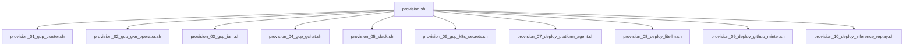

# Kubernetes Agentic Harness Operator

This directory contains the Kubernetes Operator for the `kube-agents` harness. The operator defines and manages the lifecycle of agent custom resources:

- **PlatformAgent**: Manages platform-level configuration and capabilities.

The operator is built using the Kubebuilder framework and is written in Go.

---

## Prerequisites

Before building or deploying the operator, ensure you have the following installed:

- [Go](https://go.dev/doc/install) (version 1.24+)
- [Docker](https://docs.docker.com/get-docker/) or Podman (for building container images)
- [kubectl](https://kubernetes.io/docs/tasks/tools/) (configured to access your Kubernetes/GKE cluster)
- Access to a running Kubernetes/GKE cluster
- [gcloud](https://cloud.google.com/sdk/docs/install) (for GKE cluster access)

---

## Bootstrapping GCP & GKE Infrastructure

To simplify development and testing in a real GKE/GCP environment, you can use the automated provisioning and teardown workflow. This infrastructure is fully modularized and idempotent.

### 1. The Provisioning Pipeline

To bootstrap GCP APIs, a GKE Standard cluster, Artifact Registry, Secrets, Google Chat Pub/Sub resources, build and push containers, and apply the Custom Resource (CR) in one command:

```bash
make gcp-provision
```

Or execute the master script directly from the scripts folder:

```bash
./scripts/provision.sh [--dry-run]
```

#### How it Works & Modular Sub-scripts

The master [provision.sh](scripts/provision.sh) script orchestrates nine modular sub-scripts sequentially. Each sub-script is idempotent: it verifies the state of its resources before executing any action. If a resource already exists or a step was already completed, it is skipped.



1. **[provision_01_gcp_cluster.sh](scripts/provision_01_gcp_cluster.sh)**:
   - Sets up configuration state (prompts for GCP Project ID, region, cluster name, GChat allowed user, default model configuration) and writes parameters to [scripts/vars.sh](scripts/vars.sh).
   - Enables GKE/GCP Service APIs.
   - Provisions a GKE Standard Cluster with Workload Identity.
   - Configures `kubectl` credentials and creates the target namespace.

1a. **[provision_01a_gvisor_nodepool.sh](scripts/provision_01a_gvisor_nodepool.sh)** (Optional):

- Provisions a dedicated GKE Sandbox (gVisor) node pool (defaults to `gvisor-pool`, configurable via `GVISOR_POOL_NAME`) for secure container runtime isolation. Executed automatically by `provision.sh` if `ENABLE_GVISOR=true`.

2. **[provision_02_gcp_gke_operator.sh](scripts/provision_02_gcp_gke_operator.sh)**:
   - Registers operator CRDs onto the GKE cluster.
   - Deploys the Operator controller manager.

3. **[provision_03_gcp_iam.sh](scripts/provision_03_gcp_iam.sh)**:
   - Pre-provisions GCP Service Accounts (GSAs) and Workload Identity bindings for the Controller and all Agent types.
   - Configures the Controller's GSA with cluster management permissions and annotates the Controller KSA.
   - Configures the Agent GSAs (Platform Agent) with the selected permission set (`read-only`, `gke-admin`, or `custom`).

4. **[provision_04_gcp_gchat.sh](scripts/provision_04_gcp_gchat.sh)**:
   - Creates the Pub/Sub Chat Event Topic and Subscriber Subscription for Google Chat events.

5. **[provision_05_slack.sh](scripts/provision_05_slack.sh)**:
   - Configures Slack integration parameters, bot tokens, and home channel settings.

6. **[provision_06_gcp_k8s_secrets.sh](scripts/provision_06_gcp_k8s_secrets.sh)**:
   - Prompts for or reads the `MODEL_PROVIDER` and corresponding `GEMINI_API_KEY`, `ANTHROPIC_API_KEY`, or `OPENAI_API_KEY`.
   - Creates the Kubernetes Secret (`platform-agent-secrets`) directly in the GKE Namespace.

7. **[provision_07_deploy_platform_agent.sh](scripts/provision_07_deploy_platform_agent.sh)**:
   - Generates [scripts/platform-agent.yaml](scripts/platform-agent.yaml) from its template and applies the Custom Resource (CR) to deploy the Platform Agent.

8. **[provision_08_deploy_litellm.sh](scripts/provision_08_deploy_litellm.sh)**:
   - Deploys the LiteLLM Gateway to the cluster.

9. **[provision_09_deploy_github_minter.sh](scripts/provision_09_deploy_github_minter.sh)**:
   - Sets up Google Cloud KMS keyrings and keys for token signing.
   - Deploys the GitHub Token Minter into the cluster with its authorization configs.
   - For detailed configuration instructions, see the [GitHub Token Minter README](config/integrations/github/README.md).

10. **[provision_10_deploy_inference_replay.sh](scripts/provision_10_deploy_inference_replay.sh)**:
    - Opt-in step (skipped unless `INFERENCE_REPLAY_ENABLED=true`).
    - Deploys the Inference Replay proxy in front of the LiteLLM gateway: a PVC-backed cache, a renamed `litellm-gateway` Service pointing at the original LiteLLM pods, and a replacement `litellm` Service that routes through the proxy. Always installs in pass-through mode (`mode=off`); toggle to `on` at runtime via `kubectl patch configmap inference-replay-config`.
    - For background and usage, see the [Inference Replay README](../examples/inference-replay/README.md).

#### Fast Local Development & Testing

For fast local iteration when updating agent skills, prompts, or code without waiting for CI/CD pipelines, you can use the dedicated rebuild script or `make` target:

```bash
# Run interactively via make
make dev-rebuild-agent

# Or specify arguments directly
make dev-rebuild-agent ARGS="platform"
```

- **[dev/dev_rebuild_agent.sh](scripts/dev/dev_rebuild_agent.sh)**:
  - Prompts for or accepts an agent target (`platform`).
  - Ensures the GCP Artifact Registry repository exists.
  - Builds and pushes the updated container image via Google Cloud Build (or locally with `--local`).
  - Automatically updates any running Custom Resources and rolling-restarts Kubernetes Deployments in GKE with the new image.

---

### 2. The Teardown Pipeline

To cleanly tear down and delete all provisioned GCP and GKE resources:

```bash
make gcp-teardown
```

Or run the master teardown script directly:

```bash
./scripts/teardown.sh
```

#### Modular Teardown Sub-scripts

```mermaid
graph TD
    A[teardown.sh] --> B[teardown_09_deploy_github_minter.sh]
    A --> C[teardown_08_deploy_litellm.sh]
    A --> D[dev/teardown_extra_01_deploy_extra_agents.sh]
    A --> E[teardown_07_deploy_platform_agent.sh]
    A --> F[teardown_06_gcp_k8s_secrets.sh]
    A --> G[teardown_05_slack.sh]
    A --> H[teardown_04_gcp_gchat.sh]
    A --> I[teardown_03_gcp_iam.sh]
    A --> J[teardown_02_gcp_gke_operator.sh]
    A --> K[dev/teardown_dev_01_gcp_artifact_registry.sh]
    A --> L[teardown_01_gcp_cluster.sh]
```



1. **[teardown_09_deploy_github_minter.sh](scripts/teardown_09_deploy_github_minter.sh)**:
   - Cleans up the GitHub Token Minter deployment, GSAs, and KMS resources.

2. **[teardown_08_deploy_litellm.sh](scripts/teardown_08_deploy_litellm.sh)**:
   - Undeploys the LiteLLM Gateway from the cluster.

3. **[teardown_07_deploy_platform_agent.sh](scripts/teardown_07_deploy_platform_agent.sh)**:
   - Deletes the applied `PlatformAgent` Custom Resource (safely handling finalizer blocks if they timeout).
   - Deletes the local generated `platform-agent.yaml` manifest.

4. **[teardown_06_gcp_k8s_secrets.sh](scripts/teardown_06_gcp_k8s_secrets.sh)**:
   - Deletes the GKE secret `platform-agent-secrets`.

5. **[teardown_05_slack.sh](scripts/teardown_05_slack.sh)**:
   - Resets Slack integration settings in `vars.sh`.

6. **[teardown_04_gcp_gchat.sh](scripts/teardown_04_gcp_gchat.sh)**:
   - Deletes Google Chat Pub/Sub subscriptions and topics.

7. **[teardown_03_gcp_iam.sh](scripts/teardown_03_gcp_iam.sh)**:
   - Removes GSA project-level IAM bindings and GKE Workload Identity bindings for the Controller and all Agents, and deletes their GSAs.

8. **[teardown_02_gcp_gke_operator.sh](scripts/teardown_02_gcp_gke_operator.sh)**:
   - Removes the Operator controller manager deployment and CRDs.

8a. **[teardown_01a_gvisor_nodepool.sh](scripts/teardown_01a_gvisor_nodepool.sh)** (Optional Standalone):

- Deletes the dedicated GKE Sandbox (gVisor) node pool (defaults to `gvisor-pool`, configurable via `GVISOR_POOL_NAME`) from Google Cloud to deprovision compute without destroying the cluster.

9. **[dev/teardown_dev_01_gcp_artifact_registry.sh](scripts/dev/teardown_dev_01_gcp_artifact_registry.sh)**:

- Deletes the GCP Artifact Registry repository created during local dev rebuilds.

9. **[teardown_01_gcp_cluster.sh](scripts/teardown_01_gcp_cluster.sh)**:

- Deletes the GKE Standard Cluster and local state files (`scripts/vars.sh`).

---

### 3. Sourcing Variables & Configuration State

On the first execution of `make gcp-provision` (or `provision_01_gcp_cluster.sh`), you will be prompted for target values. These are saved to **[scripts/vars.sh](scripts/vars.sh)**.

Subsequent script runs will skip the interactive configuration and automatically load variables from `vars.sh`. To re-configure or customize settings, you can edit `vars.sh` directly or delete it to be prompted again.

---

### 4. Advanced Execution Options

- **Dry-Run Mode**: To print the actions that would be executed without modifying any cloud resources, pass `ARGS="--dry-run"`:
  ```bash
  make gcp-provision ARGS="--dry-run"
  ```

---

### 5. Running Individual Steps with `make`

Each sub-step in the pipeline is standalone, idempotent, and automatically sources its configuration from `scripts/vars.sh`. Instead of running the entire pipeline or invoking scripts directly, you can execute individual steps using specialized `make` targets.

#### Provisioning Targets

You can execute individual provisioning steps in order:

1. **Step 1: Provision GKE cluster and initial GCP environment**
   ```bash
   make gcp-provision-01-cluster
   ```
2. **Step 2: Install operator CRDs and deploy controller manager**
   ```bash
   make gcp-provision-02-operator
   ```
3. **Step 3: Configure IAM service accounts and Workload Identity**
   ```bash
   make gcp-provision-03-iam
   ```
4. **Step 4: Configure secrets directly in GKE**
   ```bash
   make gcp-provision-04-secrets
   ```
5. **Step 5: Setup Google Chat Pub/Sub topic and subscription**
   ```bash
   make gcp-provision-05-gchat
   ```
6. **Step 6: Deploy the PlatformAgent Custom Resource**
   ```bash
   make gcp-provision-06-deploy
   ```

#### Teardown Targets

You can clean up specific layers of the deployment:

1. **Step 6 Teardown: Delete the PlatformAgent Custom Resource**
   ```bash
   make gcp-teardown-06-deploy
   ```
2. **Step 5 Teardown: Delete Google Chat Pub/Sub resources**
   ```bash
   make gcp-teardown-05-gchat
   ```
3. **Step 4 Teardown: Clean up Kubernetes secrets**
   ```bash
   make gcp-teardown-04-secrets
   ```
4. **Step 3 Teardown: Remove IAM service accounts and policies**
   ```bash
   make gcp-teardown-03-iam
   ```
5. **Step 2 Teardown: Undeploy the operator and CRDs**
   ```bash
   make gcp-teardown-02-operator
   ```
6. **Step 1 Teardown: Delete GKE cluster and local configuration state**
   ```bash
   make gcp-teardown-01-cluster
   ```

---

## Local Development (Fast Iteration)

For local development and testing, you can run the operator controller as a local Go process on your machine, while pointing it to a remote GKE or local Kubernetes cluster. This bypasses the need to build and push container images on every code change.

### Step 1: Set Active Kubernetes Context

Ensure your `kubectl` is pointed to the correct cluster:

```bash
# Check the active context
kubectl config current-context

# If needed, authenticate and switch to your GKE cluster
gcloud container clusters get-credentials <CLUSTER_NAME> --zone <ZONE> --project <PROJECT_ID>
```

### Step 2: Install the Custom Resource Definitions (CRDs)

Register the operator's Custom Resource Definitions (CRDs) with the cluster:

```bash
make install
```

> [!NOTE]
> This command uses `controller-gen` to generate the CRD manifests from Go structs and applies them to the cluster via `kustomize`.

### Step 3: Run the Operator Locally

Start the operator controller process. Because admission webhooks require TLS certificates (typically managed by cert-manager when running inside the cluster), you should run the operator locally with webhooks disabled by setting the `ENABLE_WEBHOOKS=false` environment variable:

```bash
ENABLE_WEBHOOKS=false make run
```

Or directly run the main entry point:

```bash
ENABLE_WEBHOOKS=false go run ./cmd/main.go
```

> [!TIP]
> This compiles and runs the entry point [main.go](cmd/main.go) with webhooks disabled. The process runs in the foreground, prints reconciliation logs, and watches for custom resource events in the cluster.

### Step 4: Apply Sample Custom Resources

In another terminal window, apply the sample custom resources to test the controllers:

```bash
kubectl apply -f examples/platformagent.yaml
```

Verify that the resources are created and recognized:

```bash
kubectl get platformagents --all-namespaces
```

You should see reconciliation logs printed in the terminal where the operator process is running.

### Step 5: Clean Up Local Resources

To stop the operator, press `Ctrl+C` in the terminal where it is running.
To uninstall the CRDs from the cluster:

```bash
make uninstall
```

---

## Building and Deploying to GKE

When you are ready to deploy the operator as a deployment inside the cluster, use the following steps.

### Step 1: Build and Push the Docker Image

Build the container image and push it to a container registry (e.g., Google Artifact Registry) accessible by your GKE cluster.

#### 1. Authenticate Docker with the Registry

Before pushing, ensure your local Docker client is authenticated with Google Cloud's container registries. Run the command matching your registry domain:

```bash
# For Google Artifact Registry (recommended, e.g. us-central1 region)
gcloud auth configure-docker us-central1-docker.pkg.dev

# For Google Container Registry (legacy)
gcloud auth configure-docker gcr.io
```

#### 2. Build and Push

Set the image target URL and run the build/push targets:

```bash
# Replace with your actual registry and image tag
export IMG=us-central1-docker.pkg.dev/ai-platform-1-464114/k8s-harness-poc/kube-agents-operator:latest

# Build the image
make docker-build IMG=$IMG

# Push the image to the registry
make docker-push IMG=$IMG
```

### Step 2: Deploy the Operator Controller

Deploy the operator deployment, RBAC permissions, and CRDs into the cluster:

```bash
make deploy IMG=$IMG
```

### Step 3: Verify the Deployment

Check the status of the operator deployment:

```bash
kubectl get deployments -n kubeagents-system
kubectl get pods -n kubeagents-system
```

---

## Deploying LiteLLM Integration

> [!NOTE]
> LiteLLM is now automatically deployed during the `make gcp-provision` flow by `provision_08_deploy_litellm.sh`. The following instructions are for manual standalone deployment.

LiteLLM gateway can be deployed to the Kubernetes cluster using the `kustomize` targets in the Makefile.

### Prerequisites

To successfully deploy LiteLLM, you must have:

1. The `platform-agent-secrets` Secret created in your destination namespace (containing `GEMINI_API_KEY`, `ANTHROPIC_API_KEY`, or `OPENAI_API_KEY`).

### Step-by-Step Deployment

Run the `make deploy-litellm` target, passing the required environment variables:

```bash
# 1. Define model provider and default model name:
export MODEL_PROVIDER=gemini
export MODEL_DEFAULT_NAME=gemini-3.1-flash

# 2. Deploy LiteLLM:
make deploy-litellm
```

To uninstall/remove the LiteLLM integration:

```bash
make undeploy-litellm
```

---

## Deploying GitHub Integration

The GitHub Token Broker (Minty) can be deployed to the Kubernetes cluster using the `kustomize` targets in the Makefile.

### Prerequisites

Before deploying the GitHub integration, ensure you have:

1. Created the `github-app-credentials` Secret containing your GitHub App ID in the destination namespace.
2. Completed the Workload Identity and GCP Cloud KMS setup (see [integrations/github/README.md](integrations/github/README.md) for details).

### Step-by-Step Deployment

Run the `make deploy-github` target, passing the required environment variables:

```bash
# 1. Define the GCP and GitHub parameter variables:
export PROJECT_ID=your-gcp-project-id
export REGION=your-gcp-region
export CLUSTER_NAME=your-gke-cluster-name
export KMS_KEYRING=your-kms-keyring
export KMS_KEY=your-kms-key
export KMS_KEY_VERSION=your-kms-key-version
export GITHUB_ORG=your-github-org
export GITHUB_REPO=your-github-repo
export GITHUB_MINTER_KSA_NAME=kubeagents-github-minter
export GITHUB_MINTER_GSA_NAME=kubeagents-github-minter-gsa
export PLATFORM_AGENT_GSA_NAME=kubeagents-platform-agent-gsa

# 2. Deploy GitHub:
make deploy-github
```

To uninstall/remove the GitHub integration:

```bash
make undeploy-github
```

---

## Makefile Reference

The [Makefile](Makefile) provides several targets to automate development workflows:

| Target                                    | Description                                                              |
| :---------------------------------------- | :----------------------------------------------------------------------- |
| `make gcp-provision`                      | Bootstraps all GCP, GKE resources, and deploys the PlatformAgent.        |
| `make gcp-teardown`                       | Cleans up and deletes all provisioned GKE/GCP resources.                 |
| `make gcp-provision-01-cluster`           | Step 1: Provision GKE cluster and initial GCP environment.               |
| `make gcp-provision-02-operator`          | Step 2: Install operator CRDs and deploy controller manager.             |
| `make gcp-provision-03-iam`               | Step 3: Configure IAM service accounts and Workload Identity.            |
| `make gcp-provision-04-secrets`           | Step 4: Configure secrets directly in GKE.                               |
| `make gcp-provision-05-gchat`             | Step 5: Setup Google Chat Pub/Sub topic and subscription.                |
| `make gcp-provision-06-deploy`            | Step 6: Deploy the PlatformAgent Custom Resource.                        |
| `make dev-rebuild-agent`                  | Fast local iteration: rebuild and redeploy an agent image.               |
| `make gcp-teardown-06-deploy`             | Teardown Step 6: Delete the PlatformAgent Custom Resource.               |
| `make gcp-teardown-05-gchat`              | Teardown Step 5: Delete Google Chat Pub/Sub resources.                   |
| `make gcp-teardown-04-secrets`            | Teardown Step 4: Clean up Kubernetes secrets.                            |
| `make gcp-teardown-03-iam`                | Teardown Step 3: Remove IAM service accounts and policies.               |
| `make gcp-teardown-02-operator`           | Teardown Step 2: Undeploy the operator and CRDs.                         |
| `make gcp-teardown-dev-artifact-registry` | Teardown Dev Step: Delete Artifact Registry created during dev rebuilds. |
| `make gcp-teardown-01-cluster`            | Teardown Step 1: Delete GKE cluster and local configuration state.       |
| `make manifests`                          | Generates WebhookConfiguration, ClusterRole, and CRDs.                   |
| `make generate`                           | Generates code containing DeepCopy implementations.                      |
| `make fmt`                                | Formats Go source code using `go fmt`.                                   |
| `make vet`                                | Examines Go source code and reports suspect constructs.                  |
| `make test`                               | Runs unit/integration tests with `setup-envtest`.                        |
| `make build`                              | Compiles the manager binary to `bin/manager`.                            |
| `make run`                                | Runs the controller locally from your host (with webhooks disabled).     |
| `make docker-build`                       | Builds the Docker image.                                                 |
| `make docker-push`                        | Pushes the Docker image to the registry.                                 |
| `make install`                            | Installs the generated CRDs into the cluster.                            |
| `make uninstall`                          | Removes the CRDs from the cluster.                                       |
| `make deploy`                             | Deploys the controller to the cluster.                                   |
| `make undeploy`                           | Removes the controller deployment from the cluster.                      |

---

## Key Files & Code Pointers

- **Main Entrypoint**: [main.go](cmd/main.go)
- **Controllers**:
  - [PlatformAgent Controller](internal/controller/platformagent_controller.go)
- **Example Resource**: [platformagent.yaml](examples/platformagent.yaml)
- **Makefile**: [Makefile](Makefile)
