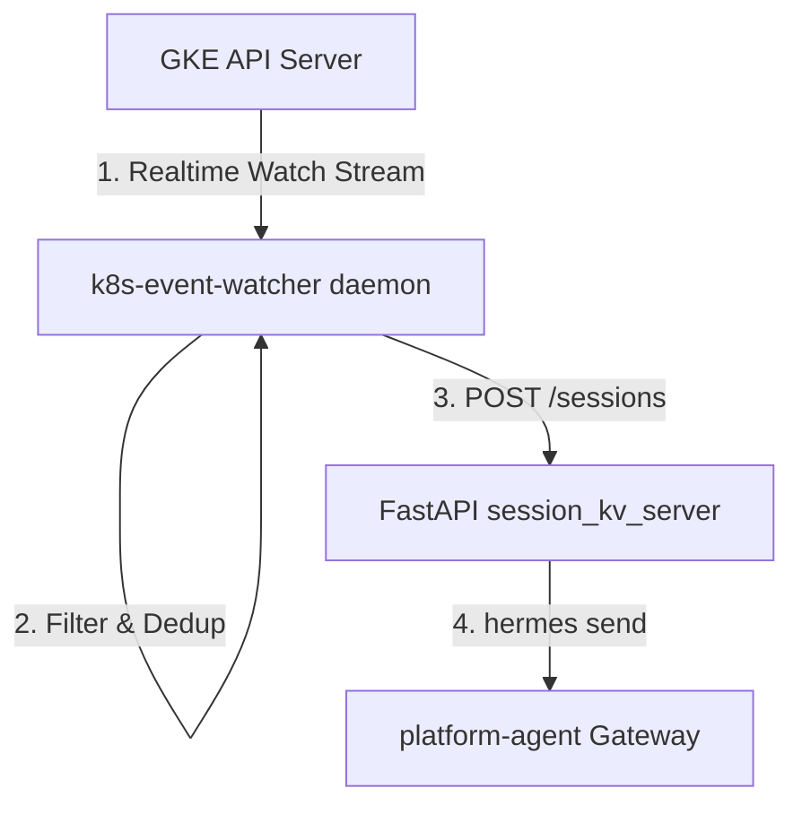

# Kubernetes Event Watcher Service

The `k8s-event-watcher` is a lightweight Go background service designed to stream, filter, and deduplicate GKE warning events in real-time, forwarding actionable alerts to the Platform Agent for autonomous incident triage.

---

## 1. Architecture & Flow

The watcher service is deployed as a **background daemon process** running inside the `platform-agent` container:



1. **Real-time Event Watcher:** Tracks warnings (`core/v1.Event`) via a client-go informer stream targeting the GKE control plane API.
2. **Local REST API Bridge:** When a new unique incident triggers, the watcher issues an HTTP `POST` containing the event details to the local session server (`http://localhost:8699/sessions`).
3. **Session Ingestion:** The session server executes the local `hermes` command-line utility, which triggers a new autonomous agent diagnostic session.

---

## 2. Filtering Mechanism

To prevent noise and API token exhaustion, incoming events are evaluated sequentially:

1. **Reason Matching:** Only events matching allowed warning reasons (defaults to 12 critical failure types like `OOMKilled`, `CrashLoopBackOff`, `FailedScheduling`, and `Evicted`) are processed.
2. **Namespace Denylist:** Any event originating from namespaces in the exclude list (e.g. `kube-system`) is immediately dropped. **Deny rules take absolute precedence.**
3. **Namespace Allowlist:** Restricts monitoring to specified namespaces. If empty, all non-excluded namespaces are watched.
4. **Flapping Probe Protection:** Probe warning events (Reason: `Unhealthy`) are ignored until they repeat at least **3 consecutive times** (`Event.Count >= 3`), preventing false alerts during rolling updates or slow restarts.

---

## 3. Deduplication & Caching

The watcher runs a thread-safe **in-memory rolling-window cache** to suppress duplicate alerts for the same underlying failure:

### Deduplication Logic

- **Canonical Reason Grouping:** Event reasons in the same failure family collapse into a single incident key (e.g., `ErrImagePull` and `ImagePullBackOff` for the same pod group into one active incident, preventing parallel troubleshooting sessions).
- **Replay Shielding:** Informer watch-connection rotations (which occur every 15–25 minutes) force client-go to re-list active events. The watcher checks the event's `LastTimestamp` to distinguish duplicates from actual new incidents, preventing duplicate alerts on connection reset.
- **Incident Retry safety:** If a warning continues to repeat after the rolling window duration (configured by `--dedup-window`, defaults to 24h in production), it is classified as a new incident to give the agent another attempt at troubleshooting.

### Memory & Persistence Guards

- **LRU Eviction (OOM Guard):** Cache memory is capped at a maximum of **10,000 active entries**. If the limit is reached, the oldest (least recently active) entry is evicted to ensure the sidecar memory footprint remains bounded.
- **On-Disk Snapshots:** At graceful shutdown and periodically during runtime (every 30 seconds), the cache is serialized to a JSON file (specified by `--dedup-persist`).
- **Atomic File Updates:** Snapshots are written to a temporary `.tmp` file and renamed atomically to ensure the persist file is never corrupted if the pod crashes.

---

## 4. Configuration & Operations

When executing the `k8s-event-watcher` service binary directly, the following command-line flags are available for configuration:

| CLI Flag                | Default Value                               | Description                                                                            |
| ----------------------- | ------------------------------------------- | -------------------------------------------------------------------------------------- |
| `--cluster-name`        | `""` (Required)                             | The cluster name tagged on every alert payload.                                        |
| `--reason`              | 12 critical failures (OOM, CrashLoop, etc.) | Comma-separated list of event reasons to monitor.                                      |
| `--exclude-namespace`   | `kube-system`                               | Comma-separated list of namespaces to ignore.                                          |
| `--dedup-window`        | `24h`                                       | Time window to suppress repeating event alerts.                                        |
| `--unhealthy-min-count` | `3`                                         | Consecutive count threshold for Unhealthy probe warnings.                              |
| `--metrics-addr`        | `""` (Disabled)                             | TCP address (`host:port`) to expose Prometheus metrics and `/healthz` check endpoints. |
| `--daemon-url`          | `http://localhost:8699`                     | The central Platform Agent Host troubleshooting gateway endpoint.                      |

### Running the Binary Directly

For local testing or standalone executions, run the compiled binary:

```bash
./k8s-event-watcher \
  --cluster-name="local-kind-cluster" \
  --daemon-url="http://localhost:8699" \
  --metrics-addr=":8080"
```

---

## 5. Integration Roadmap (PR Rollout Plan)

To minimize review overhead and ensure stable integration, the event watcher feature is split into **5 sequential phases**:

1. **PR 1: Core Go Watcher Service (Current PR):** Adds the `k8s-event-watcher` service code, unit tests, and CLI execution configurations.
2. **PR 2: Session Server REST Bridge:** Adds HTTP endpoint extensions to the Platform Gateway session KV server to receive incoming event payloads.
3. **PR 3: Kubernetes Operator Sidecar Injection:** Updates the operator controller logic to automatically inject the watcher configuration and dependencies into Platform Agent deployments.
4. **PR 4: Agent Instructions & Skill Updates:** Updates the Platform Agent's core instructions and skills to safely handle event alerts and triage warnings.
5. **PR 5: Packaging & Docker Containerization:** Updates the container Dockerfiles, entrypoint scripts, installer scripts, and adds the cluster name runtime configuration scripts.
